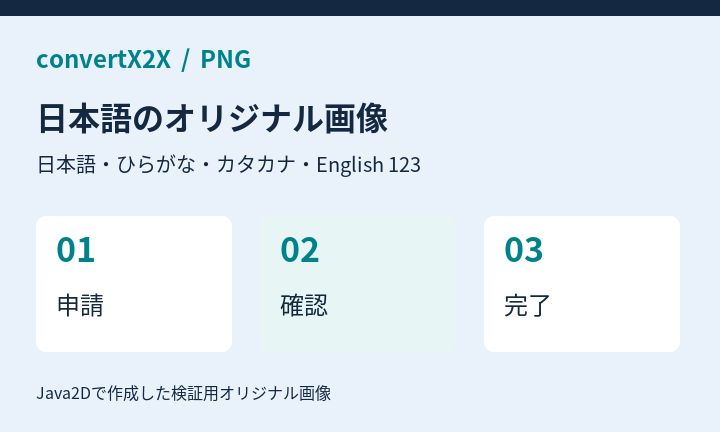
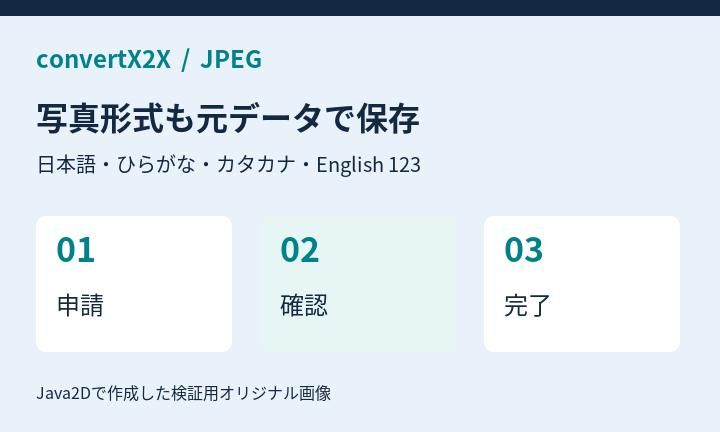
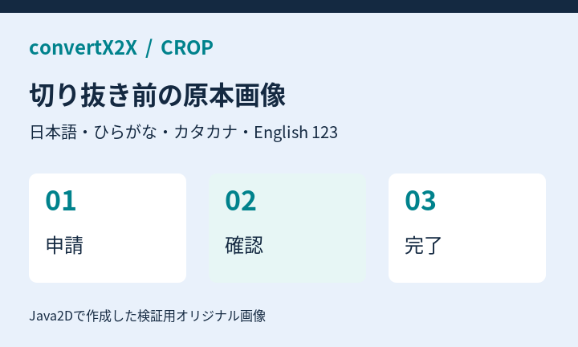

# 01\_文章と書式

**文章と書式の変換テスト**  
見出しはシート名のH1だけ。文章・部分書式・リンク・除外対象を確認します。

日本語の文章です。漢字・ひらがな・カタカナ・全角記号をそのまま残します。  
同じ段落の次の行です。

空行の後は別の段落です。

左のセル　右のセル：罫線がないため表にはしません。

**セル全体の太字**  
通常の文字と**部分太字**の文字  
**太字の中に**通常文字**を明示します**

担当：山田 花子

[Apache POI 公式サイト](https://poi.apache.org/)  
[HTTPリンク](http://example.com/guide)  
[メール窓口](mailto:help@example.com)  
[**太字のリンク**](https://example.com/bold)  
[https://example.com/blank\-label](https://example.com/blank-label)

内部リンクは表示文字のみ  
ファイルリンクは表示文字のみ  
不正なリンクは表示文字のみ

\# 見出し風の文字、\*強調風\*、\[リンク風\](https://example.invalid/)、縦棒 \| を文字として保持  
&lt;script&gt;window.\_\_fixtureInjected = true&lt;/script&gt; を文字として保持  
1\. 番号付きリスト風の文字  
セル内の1行目  
セル内の2行目

結合セルの文章は左上だけを出力します。

取消線、非表示行・列・シートの文字は出力に含めません。

# 02\_罫線の表

**罫線から表を検出**  
閉じた格子だけを表にします。元の先頭行、空の行・列、結合セルも確認します。

|  |  |  |  |
| --- | --- | --- | --- |
| **項目** | **数量** |  | **備考** |
| 売上 | 12 |  | 通常と**重要**の混在 |
|  |  |  |  |
| 予算 | 0 |  | 上限 \| 下限 |
| 取消線 |  |  | 残る説明 |
| リンク |  |  | [表のリンク 2行目](https://example.com/table) |

|  |  |  |
| --- | --- | --- |
| **別の表** | **値** | **状態** |
| 東日本 | 100 | OK |
| 西日本 | 200 | OK |
| 合計 | 300 | 完了 |

|  |  |  |
| --- | --- | --- |
| **片側罫線** | **値** | **備考** |
| 中段 | 2 |  |
| 最終行 | 3 | 閉じた格子 |

|  |  |
| --- | --- |
| **可視の項目** | **値** |
| 表示される行 | 42 |
| 末尾 | 43 |

|  |  |  |
| --- | --- | --- |
| **結合した見出し** |  |  |
| A項目 | 10 | 完了 |
| B項目 | 20 | 確認中 |
| C項目 | 30 | 完了 |

| **商品名** | **個数** | **単位** |
| --- | --- | --- |
| りんご | 3 | 個 |
| みかん | 5 | 個 |
| バナナ | 2 | 本 |

スタイルだけの表　値　備考  
データA　10　直接罫線なし  
データB　20　文章として出力  
データC　30

**単一セルの囲みは文章**　**閉じていない罫線**　**値**　**備考**  
途中の行　10　文章として保持  
最終の行　20　右下の外周が欠ける

下線だけでは表にしません

条件付き書式の見た目は再評価せず、通常の保存値と直接書式を使います。  
100

# 03\_表示値と数式

**表示値と数式キャッシュ**  
保存済みの表示値を使用します。数式を再計算せず、外部のデータを取得しません。

先頭のゼロ　00042  
桁区切り　12,345.67  
通貨　¥12,800  
パーセント　12.5%  
日付　2026/09/09  
時刻　13:45  
負数の表示　(1,234)  
指数表記　1.23E\+06  
真偽値　TRUE  
エラー値　\#DIV/0\!  
ゼロも残す　0  
空セルは空のまま

保存キャッシュ999（数式は1\+2）　999  
数式の通貨表示　¥12,345

キャッシュなしの数式　=1\+2

リンク先と表示が文字列リテラル　[数式の公式リンク](https://poi.apache.org/spreadsheet/)  
リンク先は固定、表示は保存値　[保存されたリンク表示](https://example.com/cached)  
リンク先が動的ならリンク化しない　動的なリンク表示

IMAGE関数は取得しない　\[セル内画像: 未対応\]

取消線がある数値も除外

# 04\_画像

**04  貼り付け画像と配置**

**IMG01  PNG：元のバイト列と形式を保持**　**IMG02  JPEG：元のバイト列と形式を保持**

**IMG03  同じPNGを2か所に配置：ファイルは共有**

**IMG04  罫線表に重なる画像：Markdownでは表の直後**

|  |  |  |  |  |
| --- | --- | --- | --- | --- |
| 項目 | 状態 | 担当 | 期限 | 備考 |
| 申請 | 完了 | 山田 | 9/10 | 確認済み |
| 確認 | 進行中 | 佐藤 | 9/12 | 画像が重なる範囲 |
| 決裁 | 未着手 | 鈴木 | 9/15 | 予定 |
| 通知 | 未着手 | 高橋 | 9/16 | メール |
| 保管 | 未着手 | 田中 | 9/18 | 完了後 |

<strong>この本文より先に、表と画像が続いて出力されます。</strong>

**IMG05–07  明示非表示・非表示行・非表示列の画像は除外**

# 05\_基本図形

**05  基本図形・日本語・文字書式**

**SHP01  四角**　**角丸四角**　**円・楕円**

**SHP02  基本矢印：右・左・上・下**

**SHP03  直線**　**直線コネクター：保存端点・矢印**

**SHP04  ゴシック：通常 / 太字**

**明朝：通常 / 太字**

**SHP05  テキストボックス：部分取消線・太字・リンク**

[Apache POIの公式サイト](https://poi.apache.org/)

**SHP06  左右反転した右矢印**

**15度回転した角丸四角**　**SHP07  テーマのaccent1を指定した塗り**

# 06\_グループと接続

**06  グループ・接続・重なり**

**GRP01  明示グループ：図形・線・画像を個別に出力**

**GRP02  入れ子グループ：座標の拡大縮小と10度回転**

**GRP03  未グループ：コネクターの接続先IDで1枚にまとめる**

**GRP04  未グループ：重なった図形も個別に出力**

**GRP05  背景図形＋PNG：図形と画像を別々に出力**

# 07\_未対応と加工

**07  未対応要素と加工の通知**

**UNS01  実データの棒グラフ：描画は未対応、元のセル値は保持**

[グラフ・SmartArtなどの描画は未対応です] グラフ・SmartArt等、時計回り0度、基準=シート左上、外接矩形 X=252.061pt、Y=84pt、幅=756.184pt、高さ=264pt

7月　12  
8月　18  
9月　25

**UNS02  星形：代替表示と文字を保持**　**UNS03  グラデーション：簡略化を警告**　**UNS04  縦書き：横書きへ簡略化**

[未対応の図形] 星（5角）、時計回り0度、星形の文字、基準=シート左上、外接矩形 X=0pt、Y=468pt、幅=252.061pt、高さ=192pt

**UNS05  切り抜き・回転・反転：切り抜き前の原本が保存される**　**UNS06  BMP：元ファイルを添付、画像表示はしない**

[画像、時計回り0度、BMPのオリジナル画像、基準=シート左上、外接矩形 X=567.138pt、Y=828pt、幅=378.092pt、高さ=192pt（元画像）](images/image-0004.bmp)

# 08\_画像だけ

