# [01\_文章と書式] シート

**文章と書式の変換テスト**  
見出しはシート名のH1だけ。文章・部分書式・リンク・除外対象を確認します。

日本語の文章です。漢字・ひらがな・カタカナ・全角記号をそのまま残します。  
同じ段落の次の行です。

空行の後は別の段落です。

左のセル　右のセル：罫線がないため表にはしません。

**セル全体の太字**  
通常の文字と**部分太字**の文字  
**太字の中に**通常文字**を明示します**

担当：山田 花子

[Apache POI 公式サイト](https://poi.apache.org/)  
[HTTPリンク](http://example.com/guide)  
[メール窓口](mailto:help@example.com)  
[**太字のリンク**](https://example.com/bold)  
[https://example.com/blank\-label](https://example.com/blank-label)

内部リンクは表示文字のみ  
ファイルリンクは表示文字のみ  
不正なリンクは表示文字のみ

\# 見出し風の文字、\*強調風\*、\[リンク風\](https://example.invalid/)、縦棒 \| を文字として保持  
&lt;script&gt;window.\_\_fixtureInjected = true&lt;/script&gt; を文字として保持  
1\. 番号付きリスト風の文字  
セル内の1行目  
セル内の2行目

結合セルの文章は左上だけを出力します。

取消線、非表示行・列・シートの文字は出力に含めません。

# [02\_罫線の表] シート

**罫線から表を検出**  
閉じた格子だけを表にします。元の先頭行、空の行・列、結合セルも確認します。

|  |  |  |  |
| --- | --- | --- | --- |
| **項目** | **数量** |  | **備考** |
| 売上 | 12 |  | 通常と**重要**の混在 |
|  |  |  |  |
| 予算 | 0 |  | 上限 \| 下限 |
| 取消線 |  |  | 残る説明 |
| リンク |  |  | [表のリンク 2行目](https://example.com/table) |

|  |  |  |
| --- | --- | --- |
| **別の表** | **値** | **状態** |
| 東日本 | 100 | OK |
| 西日本 | 200 | OK |
| 合計 | 300 | 完了 |

|  |  |  |  |  |
| --- | --- | --- | --- | --- |
| **片側罫線** | **値** | **備考** | **可視の項目** | **値** |
| 中段 | 2 |  | 表示される行 | 42 |
| 最終行 | 3 | 閉じた格子 | 末尾 | 43 |

|  |  |  |
| --- | --- | --- |
| **結合した見出し** |  |  |
| A項目 | 10 | 完了 |
| B項目 | 20 | 確認中 |
| C項目 | 30 | 完了 |

| **商品名** | **個数** | **単位** | スタイルだけの表 | 値 | 備考 |
| --- | --- | --- | --- | --- | --- |
| りんご | 3 | 個 | データA | 10 | 直接罫線なし |
| みかん | 5 | 個 | データB | 20 | 文章として出力 |
| バナナ | 2 | 本 | データC | 30 |  |

**単一セルの囲みは文章**　**閉じていない罫線**　**値**　**備考**  
途中の行　10　文章として保持  
最終の行　20　右下の外周が欠ける

下線だけでは表にしません

条件付き書式の見た目は再評価せず、通常の保存値と直接書式を使います。  
100

# [03\_表示値と数式] シート

**表示値と数式キャッシュ**  
保存済みの表示値を使用します。数式を再計算せず、外部のデータを取得しません。

先頭のゼロ　00042  
桁区切り　12,345.67  
通貨　¥12,800  
パーセント　12.5%  
日付　2026/09/09  
時刻　13:45  
負数の表示　(1,234)  
指数表記　1.23E\+06  
真偽値　TRUE  
エラー値　\#DIV/0\!  
ゼロも残す　0  
空セルは空のまま

保存キャッシュ999（数式は1\+2）　999  
数式の通貨表示　¥12,345

キャッシュなしの数式　=1\+2

リンク先と表示が文字列リテラル　[数式の公式リンク](https://poi.apache.org/spreadsheet/)  
リンク先は固定、表示は保存値　[保存されたリンク表示](https://example.com/cached)  
リンク先が動的ならリンク化しない　動的なリンク表示

IMAGE関数は取得しない　\[セル内画像: 未対応\]

取消線がある数値も除外

# [04\_画像] シート

**04  貼り付け画像と配置**

**IMG01  PNG：元のバイト列と形式を保持**　**IMG02  JPEG：元のバイト列と形式を保持**

図中の項目：

- shape-1（画像）：PNGの日本語サンプル

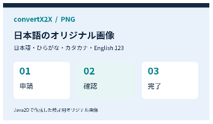

図中の項目：

- shape-2（画像）：JPEGの日本語サンプル

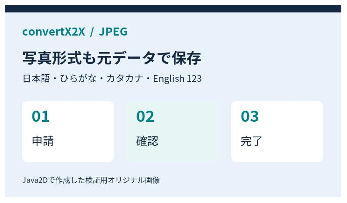

**IMG03  同じPNGを2か所に配置：ファイルは共有**

図中の項目：

- shape-3（画像）：同一PNGの配置1

図中の項目：

- shape-4（画像）：同一PNGの配置2

**IMG04  罫線表に重なる画像：Markdownでは表の直後**

|  |  |  |  |  |  |
| --- | --- | --- | --- | --- | --- |
| 項目 | 状態 | 担当 | 期限 | 備考 |  |
| 申請 | 完了 | 山田 | 9/10 | 確認済み | <strong>この本文より先に、表と画像が続いて出力されます。</strong> |
| 確認 | 進行中 | 佐藤 | 9/12 | 画像が重なる範囲 |  |
| 決裁 | 未着手 | 鈴木 | 9/15 | 予定 |  |
| 通知 | 未着手 | 高橋 | 9/16 | メール |  |
| 保管 | 未着手 | 田中 | 9/18 | 完了後 |  |

図中の項目：

- shape-5（画像）：罫線表に重なるPNG

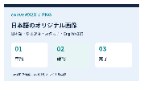

**IMG05–07  明示非表示・非表示行・非表示列の画像は除外**

# [05\_基本図形] シート

**05  基本図形・日本語・文字書式**

**SHP01  四角**　**角丸四角**　**円・楕円**

図中の項目：

- shape-1-1（長方形）：四角 受付内容

図中の項目：

- shape-2（角丸長方形）：**角丸四角** **承認待ち**

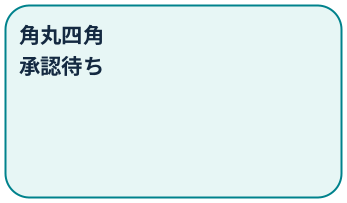

図中の項目：

- shape-3（楕円）：楕円 完了

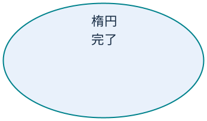

**SHP02  基本矢印：右・左・上・下**

図中の項目：

- shape-4（右矢印）：**右**

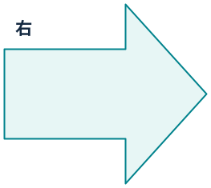

図中の項目：

- shape-5（左矢印）：**左**

図中の項目：

- shape-6（上矢印）：**上**

図中の項目：

- shape-7（下矢印）：**下**

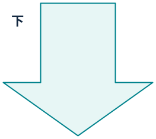

**SHP03  直線**　**直線コネクター：保存端点・矢印**

接続関係（保存情報）：

- shape-8：接続関係不明（接続先の保存情報がありません）

接続関係（保存情報）：

- shape-1-9：接続関係不明（接続先の保存情報がありません）

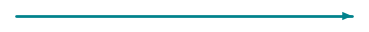

**SHP04  ゴシック：通常 / 太字**

図中の項目：

- shape-10（長方形）：日本語の表示確認 ひらがな あいうえお カタカナ アイウエオ

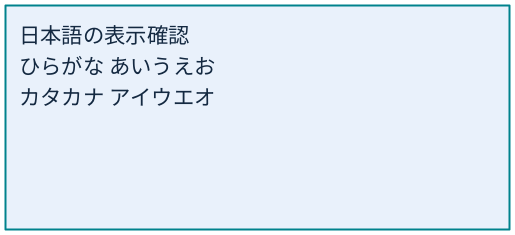

図中の項目：

- shape-11（長方形）：**日本語の表示確認** **東京都・株式会社** **売上報告 ABC 123**

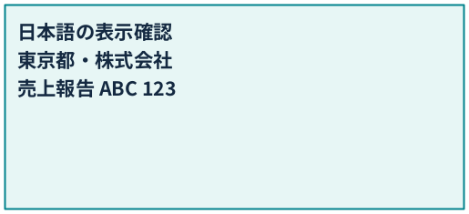

**明朝：通常 / 太字**

図中の項目：

- shape-12（長方形）：明朝体の表示確認 ひらがな あいうえお 東京都・株式会社

図中の項目：

- shape-13（長方形）：**明朝体の表示確認** **日本語と English** **２０２６年９月**

**SHP05  テキストボックス：部分取消線・太字・リンク**

図中の項目：

- shape-14（長方形）：価格：<strong>1,200円（更新後）</strong> [Apache POIの公式サイト](https://poi.apache.org/)

**SHP06  左右反転した右矢印**

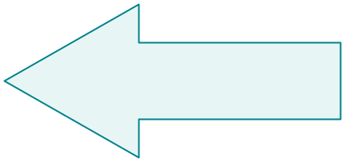

**15度回転した角丸四角**　**SHP07  テーマのaccent1を指定した塗り**

図中の項目：

- shape-16（角丸長方形）：**回転した図形** **位置と文字を保持**

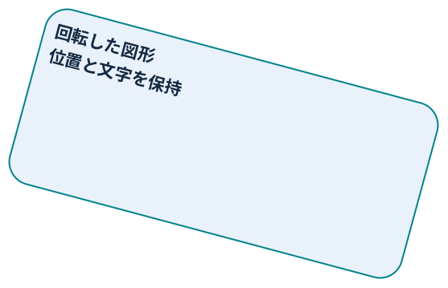

図中の項目：

- shape-17（角丸長方形）：テーマ色 accent1

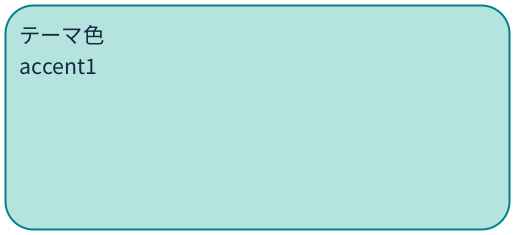

# [06\_グループと接続] シート

**06  グループ・接続・重なり**

**GRP01  明示グループ：文字を本文へ、図形・線・画像は確認用に合成**

図中の項目：

- shape-1-1（角丸長方形）：**グループ** **受付**
- shape-1-2（楕円）：確認 完了
- shape-1-4（画像）：明示グループに含まれるPNG

接続関係（保存情報）：

- shape-1-3：接続関係不明（接続先の保存情報がありません）

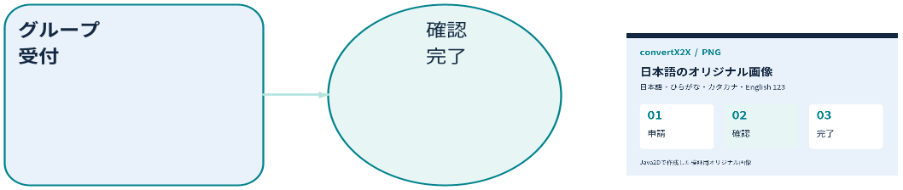

**GRP02  入れ子グループ：座標の拡大縮小と10度回転**

図中の項目：

- shape-1-5（長方形）：**内側のグループ** **左の図形**
- shape-1-6（角丸長方形）：内側のグループ 右の図形

図形間の接続情報はありません。配置から順序や関係を推測していません。

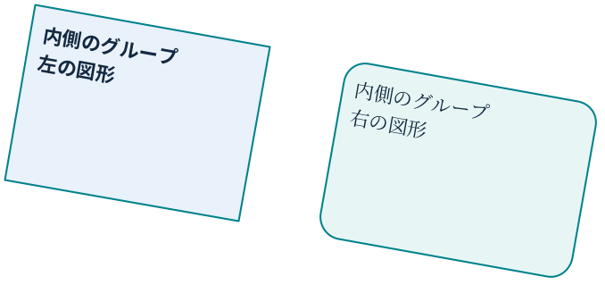

**GRP03  未グループ：コネクターの接続先IDで1枚にまとめる**

図中の項目：

- shape-3（角丸長方形）：**受付**
- shape-4（角丸長方形）：**完了**

接続関係（保存情報）：

- shape-1-9：shape-3「受付」 → shape-4「完了」

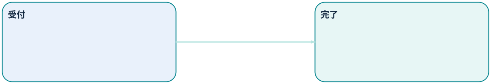

**GRP04  未グループ：重なった図形も個別に出力**

図中の項目：

- shape-6（長方形）：背面の四角

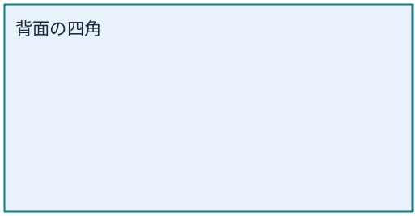

図中の項目：

- shape-7（楕円）：**前面の楕円**

**GRP05  背景図形＋PNG：図形と画像を別々に出力**

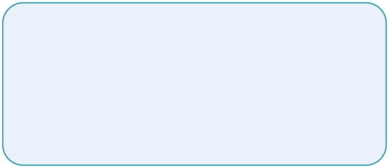

図中の項目：

- shape-9（画像）：背景図形に重なるPNG

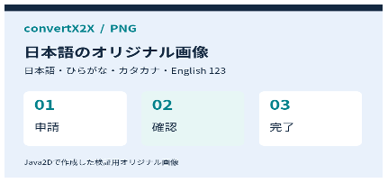

# [07\_未対応と加工] シート

**07  未対応要素と加工の通知**

**UNS01  実データの棒グラフ：描画は未対応、元のセル値は保持**

[グラフ・SmartArtなどの描画は未対応です]

7月　12  
8月　18  
9月　25

**UNS02  星形：代替表示と文字を保持**　**UNS03  グラデーション：簡略化を警告**　**UNS04  縦書き：横書きへ簡略化**

図中の項目：

- shape-2（星（5角））：**星形の文字**

[未対応の図形]

図中の項目：

- shape-3（長方形）：グラデーション 簡略化の通知を確認

図中の項目：

- shape-4（長方形）：縦書きの日本語 簡易描画の対象

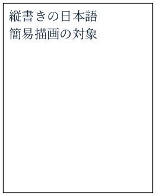

**UNS05  切り抜き・回転・反転：切り抜き前の原本が保存される**　**UNS06  BMP：元ファイルを添付、画像表示はしない**

図中の項目：

- shape-5（画像）：加工前の原本画像

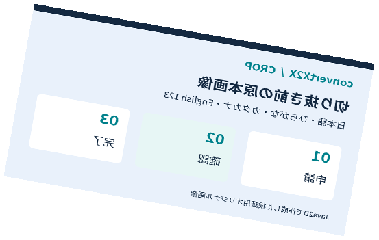

図中の項目：

- shape-6（画像）：BMPのオリジナル画像

[{"type":"画像","text":"BMPのオリジナル画像","x":567.138,"y":828,"width":378.092,"height":192}](images/image-0001.bmp)

# [08\_画像だけ] シート

図中の項目：

- shape-1（画像）：セル値を持たないシートの画像

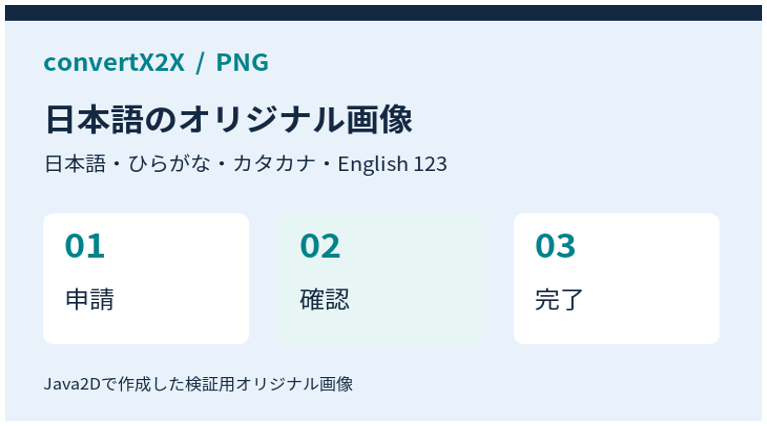
