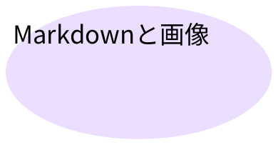

# PowerPointからMarkdownへ

日本語の本文・箇条書き・表・図・画像の実変換サンプルです。

3\. 保存した番号を保つ
4\. 外部コンテンツを取得しない
- 日本語と English ABC123 を保持

[資料へのリンク](https://example.com/reference)

# 罫線なしの表もMarkdown表に

|  |  |  |
| --- | --- | --- |
| 担当 | 内容 | 状態 |
| 開発 | 日本語と保存済み書式 | 完了 |
| 検証 | 入力ファイルから実際に変換 | 実施中 |
| 結合セルは開始セルだけに残す |  |  |

# 図は画像と説明文として残す

[入力ファイル](https://example.com/input)

図内の文字は画像説明に含め、本文に重ねて出力しません。

# 保存済みの埋め込み画像

