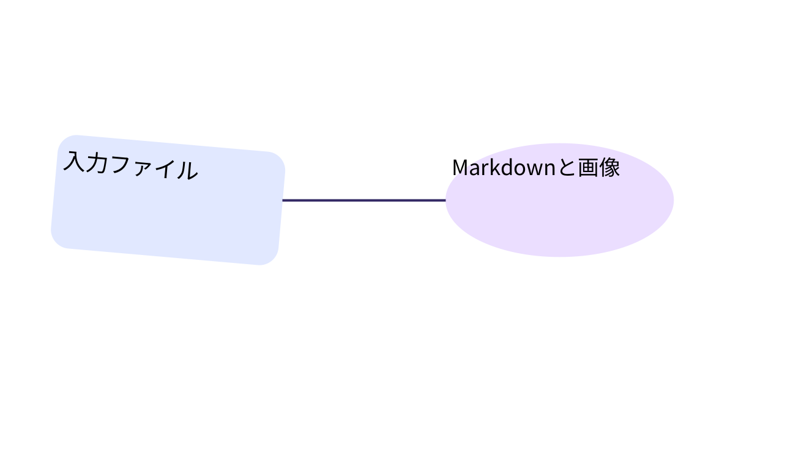
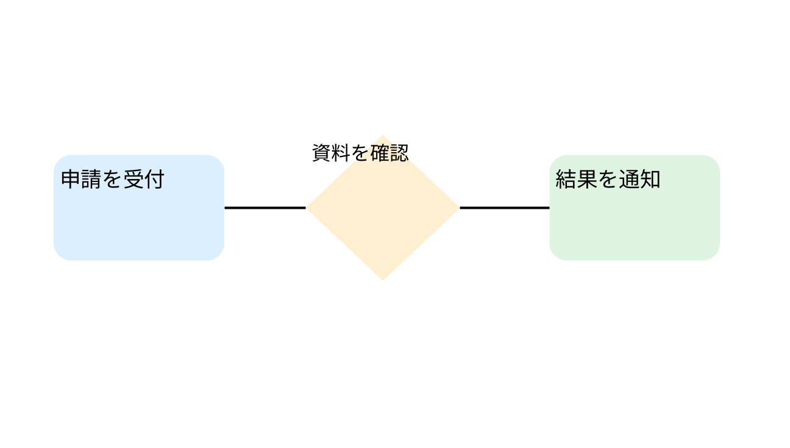

[page 1]

# PowerPointからMarkdownへ

日本語の本文・箇条書き・表・図・画像の実変換サンプルです。

3\. 保存した番号を保つ
4\. 外部コンテンツを取得しない
- 日本語と English ABC123 を保持

[資料へのリンク](https://example.com/reference)

[page 2]

# 罫線なしの表もMarkdown表に

|  |  |  |
| --- | --- | --- |
| 担当 | 内容 | 状態 |
| 開発 | 日本語と保存済み書式 | 完了 |
| 検証 | 入力ファイルから実際に変換 | 実施中 |
| 結合セルは開始セルだけに残す |  |  |

[page 3]

# 図中の文字を検索可能な本文へ

図内の文字は本文へ。接続先が保存されていない線の関係は推測しません。

図中の項目：

- shape-4（角丸長方形、スライド左中央）：[入力ファイル](https://example.com/input)
- shape-5（楕円、スライド右中央）：Markdownと画像

接続関係：

- shape-6：接続関係不明（接続先IDが保存されていません）。スライド中央。

参考画像（接続図）：

[page 4]

# 保存済みの埋め込み画像

画像は埋め込みデータを参照し、代替説明も残します。

図中の項目：

- shape-3（画像、スライド中央）：紺色背景と紫色の円

参考画像（図形）：

[page 5]

# 条件別の対応を表で比較

区分・条件・担当・処理を1行ずつ対応付けます。結合行の値は開始セルに保持します。

|  |  |  |  |
| --- | --- | --- | --- |
| 区分 | 条件 | 担当 | 処理 |
| 通常 | 資料あり | 受付 | 当日確認 |
| 差戻し | 添付不足 | 申請者 | 再提出 |
| 共通の補足 |  | 管理者 | 期限は営業日 |
| 例外 | 期限超過 | 責任者 | 翌朝判断 |

補足：差戻し後は同じ申請番号で再判定します。

[page 6]

# レビュー経路の図形と補足

図形のラベルを本文から検索できます。線の関係は確定できた場合だけ記録します。

図中の項目：

- shape-5（ひし形、スライド中央）：資料を確認
- shape-4（角丸長方形、スライド左中央）：申請を受付
- shape-6（角丸長方形、スライド右中央）：結果を通知

接続関係：

- shape-7：shape-4「申請を受付」 — shape-5「資料を確認」（向きなし）。スライド中央。
- shape-8：shape-5「資料を確認」 — shape-6「結果を通知」（向きなし）。スライド中央。

参考画像（接続図）：

