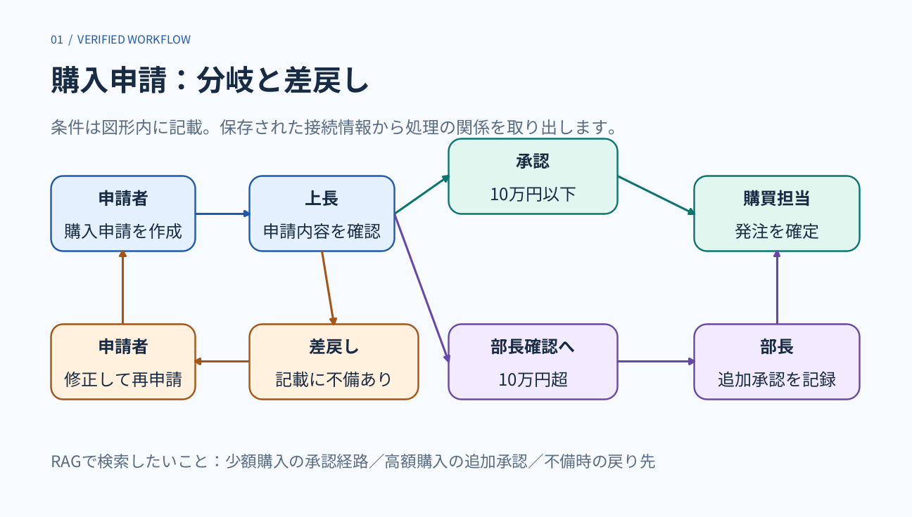
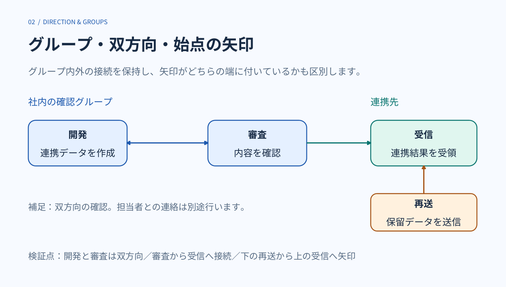
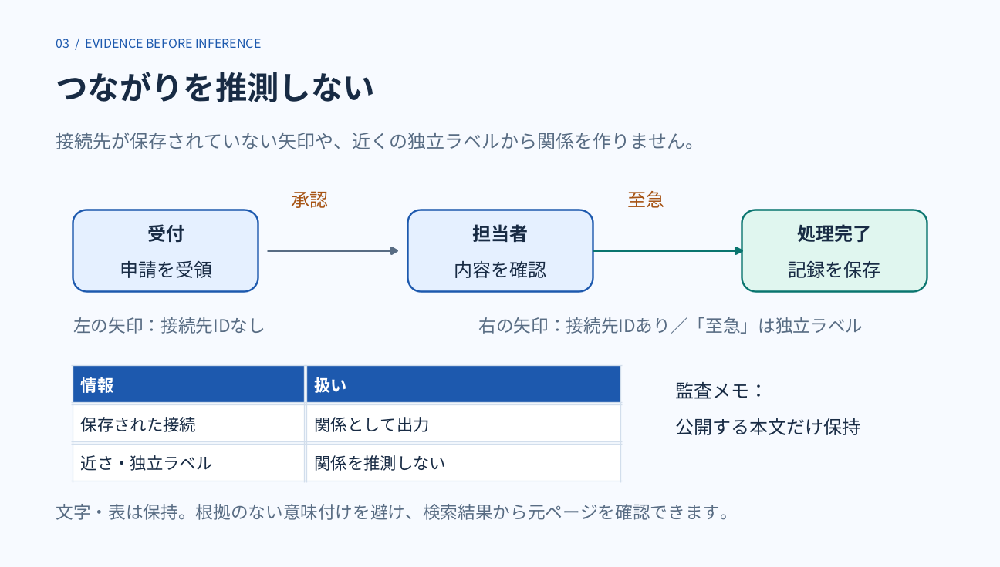

[page 1]

# 購入申請：分岐と差戻し

01  /  VERIFIED WORKFLOW

条件は図形内に記載。保存された接続情報から処理の関係を取り出します。

RAGで検索したいこと：少額購入の承認経路／高額購入の追加承認／不備時の戻り先

図中の項目：

- shape-8（角丸長方形）：**承認** 10万円以下
- shape-6（角丸長方形）：**申請者** 購入申請を作成
- shape-7（角丸長方形）：**上長** 申請内容を確認
- shape-9（角丸長方形）：**購買担当** 発注を確定
- shape-11（角丸長方形）：**申請者** 修正して再申請
- shape-10（角丸長方形）：**差戻し** 記載に不備あり
- shape-12（角丸長方形）：**部長確認へ** 10万円超
- shape-13（角丸長方形）：**部長** 追加承認を記録

接続関係（保存情報）：

- shape-14：shape-6「申請者 購入申請を作成」 → shape-7「上長 申請内容を確認」
- shape-15：shape-7「上長 申請内容を確認」 → shape-8「承認 10万円以下」
- shape-16：shape-8「承認 10万円以下」 → shape-9「購買担当 発注を確定」
- shape-17：shape-7「上長 申請内容を確認」 → shape-10「差戻し 記載に不備あり」
- shape-18：shape-10「差戻し 記載に不備あり」 → shape-11「申請者 修正して再申請」
- shape-19：shape-11「申請者 修正して再申請」 → shape-6「申請者 購入申請を作成」
- shape-20：shape-7「上長 申請内容を確認」 → shape-12「部長確認へ 10万円超」
- shape-21：shape-12「部長確認へ 10万円超」 → shape-13「部長 追加承認を記録」
- shape-22：shape-13「部長 追加承認を記録」 → shape-9「購買担当 発注を確定」

参考画像（スライド全体）：

[page 2]

# グループ・双方向・始点の矢印

02  /  DIRECTION &amp; GROUPS

グループ内外の接続を保持し、矢印がどちらの端に付いているかも区別します。

社内の確認グループ

連携先

検証点：開発と審査は双方向／審査から受信へ接続／下の再送から上の受信へ矢印

図中の項目：

- shape-9（角丸長方形）：**開発** 連携データを作成
- shape-10（角丸長方形）：**審査** 内容を確認
- shape-13（角丸長方形）：**受信** 連携結果を受領
- shape-12（テキストボックス）：補足：双方向の確認。担当者との連絡は別途行います。
- shape-14（角丸長方形）：**再送** 保留データを送信

接続関係（保存情報）：

- shape-11：shape-9「開発 連携データを作成」 ↔ shape-10「審査 内容を確認」
- shape-15：shape-10「審査 内容を確認」 → shape-13「受信 連携結果を受領」
- shape-16：shape-14「再送 保留データを送信」 → shape-13「受信 連携結果を受領」

参考画像（スライド全体）：

[page 3]

# つながりを推測しない

03  /  EVIDENCE BEFORE INFERENCE

接続先が保存されていない矢印や、近くの独立ラベルから関係を作りません。

承認

至急

左の矢印：接続先IDなし

右の矢印：接続先IDあり／「至急」は独立ラベル

| **情報** | **扱い** |
| --- | --- |
| 保存された接続 | 関係として出力 |
| 近さ・独立ラベル | 関係を推測しない |

監査メモ：
公開する本文だけ保持

文字・表は保持。根拠のない意味付けを避け、検索結果から元ページを確認できます。

図中の項目：

- shape-6（角丸長方形）：**受付** 申請を受領
- shape-7（角丸長方形）：**担当者** 内容を確認
- shape-8（角丸長方形）：**処理完了** 記録を保存

接続関係（保存情報）：

- shape-9：接続関係不明（接続先IDが保存されていません）
- shape-10：shape-7「担当者 内容を確認」 → shape-8「処理完了 記録を保存」

参考画像（スライド全体）：

