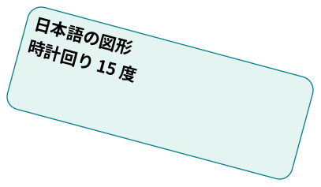

[page 1]

# **Word → Markdown の表示確認**

日本語の通常文です。見た目の文字サイズから見出しは推測しません。

## **文字と最終版の変更履歴**

太字：**重要な日本語** ／ [Apache POI 公式](https://poi.apache.org/)

保存済みの最終版：追加した文を保持します。

## **罫線のない Word の表**

| 項目 | 結果 |
| --- | --- |
| 表の構造 | 罫線がなくても Markdown 表になります。 |
| 結合セルは左上に文字を保持します。 |  |

## **番号と脚注**

3\. 番号は元の開始値 3 を保持します。

4\. 参照付きの脚注です。[^footnote-1]

## **時計回りに回転した日本語の図形**

図中の項目：

- shape-1（角丸長方形）：日本語の図形 時計回り 15 度

## **埋め込み PNG 画像**

図中の項目：

- shape-1（画像）：shapes.png

[^footnote-1]: 脚注は本文の参照順に末尾へまとめます。

