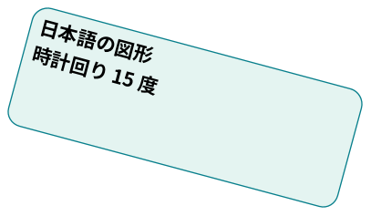
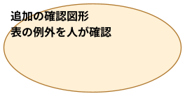

[page 1]

# **Word → Markdown の表示確認**

日本語の通常文です。見た目の文字サイズから見出しは推測しません。

## **文字と最終版の変更履歴**

太字：**重要な日本語** ／ [Apache POI 公式](https://poi.apache.org/)

保存済みの最終版：追加した文を保持します。

## **罫線のない Word の表**

| 項目 | 結果 |
| --- | --- |
| 表の構造 | 罫線がなくても Markdown 表になります。 |
| 結合セルは左上に文字を保持します。 |  |

## **判定条件と複数段落の表**

二つ目の表では、3列の判定、セル内改行、結合した補足行を同時に確認します。

| 条件 | 担当 | 判断 |
| --- | --- | --- |
| 通常申請 | 受付 | 当日確認 |
| 添付不足 | 申請者 | 差し戻し 再提出後に再判定 |
| 共通の補足：期限は営業日で数えます。 |  | 要確認 |

## **番号と脚注**

3\. 番号は元の開始値 3 を保持します。

4\. 参照付きの脚注です。[^footnote-1]

判定表の例外条件にも補足を付けます。[^footnote-2]

## **時計回りに回転した日本語の図形**

図中の項目：

- shape-1（角丸長方形）：日本語の図形 時計回り 15 度

図中の項目：

- shape-1（楕円）：追加の確認図形 表の例外を人が確認

## **埋め込み PNG 画像**

図中の項目：

- shape-1（画像）：shapes.png

[^footnote-1]: 脚注は本文の参照順に末尾へまとめます。

[^footnote-2]: 例外条件は再提出された内容を確認してから処理します。

