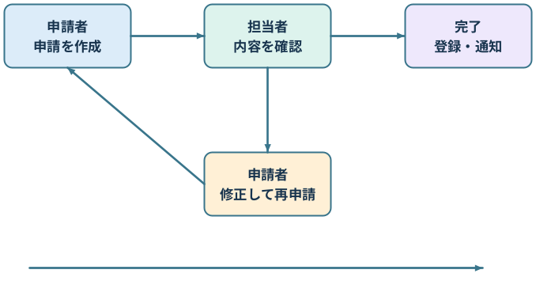

[page 1]

# **Word / 購入申請フロー**

本文の前後関係を保ち、図形の文字と保存された接続関係を検索可能な本文に残す例です。

図中の項目：

- shape-1（角丸長方形）：申請者 申請を作成
- shape-2（角丸長方形）：担当者 内容を確認
- shape-3（角丸長方形）：完了 登録・通知
- shape-4（角丸長方形）：申請者 修正して再申請

接続関係（保存情報）：

- shape-5：shape-1「申請者 申請を作成」 → shape-2「担当者 内容を確認」
- shape-6：shape-2「担当者 内容を確認」 → shape-3「完了 登録・通知」
- shape-7：shape-2「担当者 内容を確認」 → shape-4「申請者 修正して再申請」
- shape-8：shape-4「申請者 修正して再申請」 → shape-1「申請者 申請を作成」
- shape-9：接続関係不明（接続先の保存情報がありません）

図の後の説明：上段は確認から完了、下段は修正・再申請です。最下段の矢印は接続先を保存していないため、不明として扱います。

| 記録 | 保存される内容 |
| --- | --- |
| Markdown | 図中の文字・確定した関係・不明な接続 |
| report.json | 図形ID・種類・座標・接続先・方向 |

