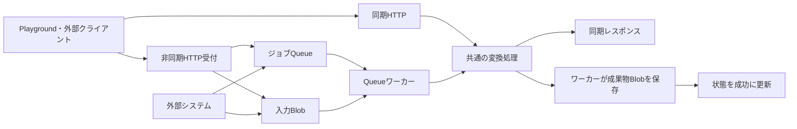

# 開発者マニュアル

convertX2Xの実装を読み、ローカルで変更・検証し、Azure Functionsへ配置するためのガイドです。初めて開発する場合は「開発環境と作業手順」から、変換動作を変更する場合は各機能のガイドへ進んでください。

## 読む順番

| ガイド | 内容 |
| --- | --- |
| [開発環境と作業手順](development.md) | 必要なツール、起動、設定、テスト、デプロイ、問題の切り分け |
| [Excel → Markdownの実装](excel2md.md) | 本文・表・数式・画像・図形の変換、成果物、拡張箇所、守る制約 |
| [PowerPoint / PDF → 画像の実装](ppt-pdf-to-images.md) | 形式別コンバーター、寸法・フォント、ZIP・個別画像、拡張箇所 |
| [機能追加・変更のルール](../CONTRIBUTING.md) | プロジェクトの分け方、互換性、設定・秘密情報、ライセンス |

HTTPの全パラメーターや環境変数の既定値は、各機能を単独で利用できるよう機能READMEにまとめています。Queueの契約は機能ごとの直接Queueガイドを参照してください。

| 機能 | 起動・API・設定 | 直接QueueのJSON・保存先 | サンプル |
| --- | --- | --- | --- |
| Excel → Markdown | [機能README](../functions/excel2md/README.md) | [直接Queue](../functions/excel2md/docs/direct-queue.md) | [包括Excelと実変換手順](../functions/excel2md/samples/README.md) |
| PowerPoint / PDF → 画像 | [機能README](../functions/ppt-pdf-to-images/README.md) | [直接Queue](../functions/ppt-pdf-to-images/docs/direct-queue.md) | [JSON・Java送信例](../functions/ppt-pdf-to-images/examples)、[PowerPoint資料](../functions/ppt-pdf-to-images/samples/templates/README.md) |

## 全体構成

各機能は独立したFunctionsプロジェクトです。Mavenの親プロジェクトや、機能間で共有する実行時ライブラリはありません。必要な機能だけをビルド・配置します。HTTPとQueueが変換処理を共有するのは、それぞれの機能の内部です。

```text
convertX2X/
├── docs/                         開発者マニュアル
├── functions/
│   ├── excel2md/                 独立したビルド・設定・デプロイ単位
│   └── ppt-pdf-to-images/        独立したビルド・設定・デプロイ単位
└── CONTRIBUTING.md               変更時の共通ルール
```

各機能の処理は次の形です。PlaygroundもHTTP APIのクライアントで、画面固有の変換処理は持ちません。



図のレスポンス返却とBlob保存は、呼び出した経路によって分かれます。直接Queueへ送るのは入力Blobの参照を含むJSONです。PowerPoint・PDF・Excelのファイル本体はQueueに入れません。

| 項目 | Excel → Markdown | PowerPoint / PDF → 画像 |
| --- | --- | --- |
| ローカルの既定ポート | `7072` | `7071` |
| 共通変換クラス | `ExcelMarkdownService` | `ConversionService` |
| Queue名 | `excel2md-jobs` | `conversion-jobs` |
| 同期出力 | Markdown・画像・reportを含むZIP | 選択した1ページの画像、または全ページZIP |
| 非同期の保存形式 | Markdown・report・画像を個別Blobに保存 | ページ指定時の単画像、全ページZIP、または画像・manifestを個別Blobに保存 |
| 既定の配布ディレクトリ | `target/azure-functions/excel2md-local` | `target/azure-functions/slide2image-local` |

HTTPのパスが似ていても、QueueのJSONや結果の取得方法は機能ごとの契約です。同じJSONを両方へ送る前提にはしないでください。

## 文書の使い分け

このマニュアルは現在の実装を保守するための説明です。[Excelの初期設計メモ](designs/excel2md.md)は採用理由・検討経緯を残した参考資料として扱います。仕様を変更したら、実装・テストと合わせて機能README、該当するQueueガイド、このマニュアルを更新してください。
