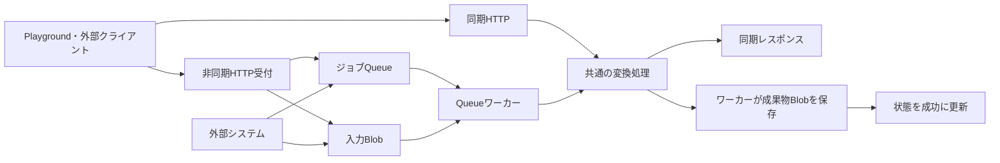

# 全体構成

各機能は独立したFunction Appへ配置するFunctionsプロジェクトです。画像・Office変換はJava 21、Movie → AACはNode.js 22 / 24です。共通の親ビルドや、機能間で共有する実行時ライブラリはありません。必要な機能だけをビルド・配置します。各機能内でHTTPとQueueが変換処理を共有します。

```text
convertX2X/
├── docs/                         開発者マニュアル
├── functions/
│   ├── office2md/              独立したビルド・設定・デプロイ単位
│   ├── ppt-pdf-to-images/        独立したビルド・設定・デプロイ単位
│   └── movie2audio/             独立したビルド・設定・デプロイ単位
└── CONTRIBUTING.md               変更時の共通ルール
```

3機能とも同期・非同期の処理は次の形です。PlaygroundもHTTP APIのクライアントで、画面固有の変換処理は持ちません。



図のレスポンス返却とBlob保存は、呼び出した経路によって分かれます。直接Queueへ送るのは入力Blobの参照を含むJSONです。文書・動画のファイル本体や認証情報はQueueに入れません。

| 項目 | Office → Markdown | PowerPoint / PDF → 画像 | Movie → AAC |
| --- | --- | --- | --- |
| 実装 | Java 21 / Apache POI | Java 21 / Apache POI / PDFBox | Node.js 22・24 / FFmpeg |
| ローカルの既定ポート | `7072` | `7071` | `7073` |
| 共通変換処理 | `OfficeMarkdownService` | `ConversionService` | `src/ffmpeg.js` の `extractAudio` |
| Queue名 | `office2md-jobs` | `conversion-jobs` | `movie2audio-jobs` |
| 同期出力 | Markdown・画像・reportを含むZIP | 選択した1ページの画像、または全ページZIP | M4A。SAS指定先へ保存するAPIは結果JSON |
| 非同期の保存形式 | Markdown・report・画像を個別Blobに保存 | ページ指定時の単画像、全ページZIP、または画像・manifestを個別Blobに保存 | M4Aを個別Blobに保存 |
| 既定の配布ディレクトリ | `target/azure-functions/office2md-local` | `target/azure-functions/slide2image-local` | `dist/` |

HTTPのパスが似ていても、QueueのJSONや結果の取得方法は機能ごとの契約です。対象機能の依頼形式に合わせてください。

Movie → AACはローカル既定ポート `7073`、配布ディレクトリ `dist/` を使います。`POST /convert` に動画、`POST /convert-url` にURLのJSONを送り、共通の `src/ffmpeg.js` で最初の音声トラックがAACの場合に `audio.m4a` へコピーします。非同期では `POST /jobs`・`POST /jobs-url` からQueue `movie2audio-jobs` に登録し、外部システムから同じQueueへ直接依頼することもできます。Queue経由のM4Aは個別Blobへ保存します。URL入力は許可ホスト設定時、非同期はStorage接続設定時だけ有効です。[Movieの実装ガイド](movie2audio.md)を参照してください。

Movieの呼び出し契約は [同期HTTP](APIDocs/movie2audio/http.html)・[同期SAS保存](APIDocs/movie2audio/storage.html)・[非同期HTTP](APIDocs/movie2audio/jobs.html)・[直接Queue](APIDocs/movie2audio/queue.html) に分かれます。実装変更時は、共有するFFmpeg処理と実行枠、入力・出力の容量、処理期限、再試行時の結果公開を確認します。ローカルFunctionsとAzuriteを使う手順は [開発環境と検証](development.md#movie--aacの実変換) にあります。
