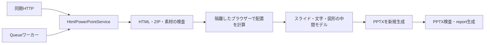

# html2pptx 設計案

2026-09-11時点の提案。設計のみで、変換機能・API・Azureへの配置は未実装。推奨案は、HTML/CSSで配置した文字・基本図形・表を編集可能なPowerPointへ変換する方式とする。編集可能性と見た目のどちらを優先するかについて、利用者の回答によって調整できるよう判断点を残す。

既存の4GB Flex Consumptionを配置先の希望として引き継ぐ。ただし、HTML描画に必要なブラウザーの動作・隔離は、この環境ではまだ確認していない。コンテナーを使う別プランへの移行を決定した設計ではない。

## 推奨する仕様

| 項目 | 初期版の提案 |
| --- | --- |
| 提供単位 | 独立した `functions/html2pptx/`。実装開始時に作成する |
| 入力 | UTF-8の `.html` / `.htm`、または `index.html` と素材をまとめた `.zip` |
| スライド境界 | `data-slide` を付けた要素ごとに1枚。指定がなければ本文全体を1枚 |
| 大きさ | 既定1280×720 CSS px、16:9。入力HTMLのmetaで全スライド共通の寸法を指定可能 |
| 編集可能にするもの | 文字、文字装飾、リンク、長方形・角丸・楕円・線、画像の配置、単純な表 |
| 画像化 | 明示指定された範囲だけをPNG化。画像化範囲内の文字も編集不可とreportへ記録 |
| 出力 | `presentation.pptx` と `report.json` |
| 呼び出し | 同期HTTP、非同期HTTP、直接Queue。共通の変換サービスを呼ぶ |
| 非同期の有効化 | `CONVERSION_STORAGE_CONNECTION_STRING` 設定時のみ |
| Playground | HTML/CSS/JavaScriptのみ。HTML入力・ファイル選択・変換結果のダウンロード |
| 外部参照 | URLからのHTML取得、外部画像・CSS・フォントの取得を行わない |
| 実行コード | 入力HTMLのJavaScript・イベントハンドラーを実行しない |

任意のWebページを自動的にプレゼン資料へ再構成する機能にはしない。文章の要約、スライド数の推定、図の意味の解釈、LLMによるレイアウト生成は行わない。

## HTMLの書き方

最小入力は普通のHTML。複数枚にする場合だけ、明示的なスライド境界を付ける。追加のmanifest JSONは必須にしない。

```html
<!doctype html>
<html lang="ja">
<head>
  <meta charset="UTF-8">
  <meta name="pptx-slide-width" content="1280">
  <meta name="pptx-slide-height" content="720">
  <style>
    [data-slide] { padding: 64px; background: #fff; }
    h1 { font-size: 48px; color: #17324d; }
    .cards { display: flex; gap: 32px; }
    .card { width: 480px; padding: 24px; background: #edf4fa; }
  </style>
</head>
<body>
  <section data-slide>
    <h1>四半期の結果</h1>
    <div class="cards">
      <div class="card"><strong>売上</strong><p>前年比120%</p></div>
      <div class="card"><strong>顧客数</strong><p>前年比115%</p></div>
    </div>
  </section>
  <section data-slide>
    <h1>次の取り組み</h1>
    <p>既存顧客へのサポートを拡充します。</p>
  </section>
</body>
</html>
```

この例では、タイトル・本文はテキストボックス、カード背景は図形として配置する。カード全体を1枚の画像にはしない。

- スライド順はDOMの順。`data-slide` の入れ子、境界外にある表示内容はエラーにし、黙って欠落させない。
- スライドのボックスは変換側が指定寸法・`box-sizing: border-box` で固定する。全スライドの寸法は共通。既定のbody余白を除き、画面倍率・印刷用CSSには依存させない。
- 幅・高さのmetaは両方指定する。正の有限な整数CSS pxだけを許可し、環境側の寸法・画素数上限内か検査する。
- コンテンツがスライド外へはみ出す場合は `SLIDE_OVERFLOW`。自動縮小、文字の途中での改ページ、暗黙の切り捨てはしない。
- 通常の長いHTMLも、初期版では自動ページ分割しない。スライド区切りを付けるか、1枚に収まる寸法・内容へ調整する。
- 画像・CSSはZIP内の相対パスを使う。HTML単体ではstyle要素・style属性と、検査済みPNG/JPEGのdata URIを利用できる。別ファイルを参照する場合はZIPを使う。

```text
input.zip
├── index.html
├── styles.css
└── assets/
    ├── logo.png
    └── photo.jpg
```

## 変換方式と技術選定

HTMLを構文解析するだけでは、CSS適用後の折り返し・Flex/Gridの配置は確定しない。推奨するのは、ブラウザーで計算した配置を中間モデルへ取り出し、PPTXの要素として新規作成する方式。



第一候補はJava 21、Playwright Java＋Chromium、Apache POI XSLF。既存のジョブ処理・検証経験を使いつつ、ブラウザーによる配置計算とPPTXへのマッピングを分離する。POIはスライド・画像・テキスト・リンクを生成できるが、この資料で提案するHTML/CSS変換層は実装が必要。[POI XSLF Cookbook](https://poi.apache.org/components/slideshow/xslf-cookbook.html)

実装前の小規模検証では既存OSSも比較し、自前の変換層が必要な範囲を確認する。

| 候補 | 判断 |
| --- | --- |
| Playwright Java＋POI | 第一候補。対応するHTML/CSSと失敗条件を制御しやすい。CSSからPPTXへの変換層が必要 |
| [dom-to-pptx](https://github.com/atharva9167j/dom-to-pptx/blob/master/Readme.md) | 比較対象。ブラウザーで配置を読みPPTXを作る。画像化される要素や非対応CSSもあるため、日本語・外部通信・警告の制御を含めて評価する |
| PptxGenJSの `tableToSlides` | HTMLの表を変換するAPI。HTMLページ全体の汎用変換APIとして採用しない |
| JavaだけのHTML描画 | Flex上の代替候補。ただしブラウザーと同じCSS対応は期待できず、対応HTMLをさらに限定する必要がある |

PptxGenJSの公式HTML機能は表を対象にしている。OpenHTMLtoPDFの公式説明でもFlex/GridやJavaScriptへの非対応が明記されている。ライブラリを切り替えるだけで、任意HTMLの再現問題が解決するとは扱わない。[PptxGenJS](https://gitbrent.github.io/PptxGenJS/docs/html-to-powerpoint/)、[OpenHTMLtoPDF](https://github.com/danfickle/openhtmltopdf/blob/open-dev-v1/README.md)

dom-to-pptxの既定CLIはファイルアクセスやフォント取得も扱うため、受け付けたHTMLへそのまま適用しない。採用する場合も、この設計の資源検査・通信遮断・フォント方針を満たす統合が必要になる。[公式CLIの説明](https://github.com/atharva9167j/dom-to-pptx/blob/master/USAGE.md)

## 編集可能性と表示品質

| HTML / CSS | 初期版の出力・制約 |
| --- | --- |
| h1〜h6、p、span、div内の本文 | 実効書式を持つテキストボックス。見出しを勝手に別スライドへ移さない |
| 太字・斜体・下線・取消線・文字色・サイズ | 対応する文字装飾。office2mdの取消線削除ルールは継承せず、見た目として保持 |
| a | HTTP/HTTPS/mailtoリンク。変換中はアクセスしない。その他は表示文字を保持して警告 |
| ul / ol | 表示上の箇条書きとインデントを保持。複雑なカウンターや独自マーカーは初期対象外 |
| 単色背景・単純な罫線 | 編集可能な基本図形。非対称の角丸など、対応外の形状を黙って単純化しない |
| PNG / JPEG | PPTX内に埋め込む。移動・サイズ変更は可能。画像内容を図形や文字に分解しない |
| table | 単純な格子と結合セルはネイティブ表。入れ子表・複雑なセル内配置は対象外 |
| Flex / Grid | ブラウザーの計算結果の座標へ配置。PPTX内でFlex/Gridの自動再配置機能は保持しない |
| 回転・重なり | 対応する2D回転と描画順を保持。3D、skew、複雑なクリッピングは初期対象外 |
| display:none / visibility:hidden | 描画対象から除外 |
| SVG・canvas・動画・iframe・フォーム | 初期対象外。SVGを安全にPNG化する対応は次段階で検討 |
| JSで生成するグラフ・React等の実行前HTML | 実行しない。静的HTMLとPNG/JPEGへ事前出力してから渡す |
| 外部Webフォント・入力に含まれる任意フォント | 初期対象外。サービスに同梱したフォントを使用 |

CSS対応表は実装時にプロパティ・値まで列挙する。レイアウトに影響する未対応指定は `UNSUPPORTED_LAYOUT` で停止し、完全編集可能であるかのような成果物を返さない。許可するCSSが少ないことと、セキュリティ上の拒否は別のエラーにする。

必要な範囲には `data-pptx-render="image"` を付け、検査済みの静的HTMLをPNGとして配置できるようにする。スライド要素へ付ければ1枚全体を画像化できる。画像化を指定しなければ、未対応要素を自動で全ページ画像へ置き換えない。

画像化は安全性の検査を迂回しない。許可する静的HTML/CSSと資源の範囲は共通とし、画像化指定内ではPPTXのネイティブ要素へ対応付ける制約だけを緩和する。画像化範囲は他の要素との重なり・描画順を確認し、安全に独立して取り出せない場合はエラーとする。範囲内の文字を透明な編集可能テキストとして二重配置しない。reportには画像化範囲と理由を記録する。

### 座標・文字・フォント

- 96 CSS px = 72 ptとして変換する。既定1280×720 pxは960×540 pt。画像化の解像度は配置寸法と分離する。
- 単なる要素の外接矩形だけでなく、文字の行・書式区間・折り返し位置を計測する。親要素の全文と子要素の文字を重複出力しない。
- `getBoundingClientRect()` は外接矩形であり、回転前の寸法や文字のベースラインを表すものではない。必要な変形・文字計測を別に保持する。[MDN](https://developer.mozilla.org/en-US/docs/Web/API/Element/getBoundingClientRect/)
- 初期版ではブラウザーの折り返し位置を改行として固定し、行ごとの書式を保持する。要素を編集すればPowerPoint側で再レイアウトされるため、編集後もHTMLと同じ自動配置になるとは保証しない。
- 描画順は単なるDOM順・Y座標順だけでは決めず、対応範囲内のCSSの重なり順を反映する。未対応の合成・stacking contextを検知して停止する。
- 既存と同じNoto Sans CJK JP / Noto Serif CJK JPを、出典・ライセンス付きで機能内に同梱する。ブラウザーの計測とPNGの描画で同じフォントを使う。
- **サーバーへのフォント同梱とPPTXへのフォント埋め込みは別。** 初期版はフォント名を設定し、PPTXへフォントを埋め込まない。閲覧PCに対応フォントがなければ、PowerPointの代替フォントによる表示差が出る。変換時に代替したフォントはreportへ記録する。

## HTTP・Queue・保存先

既存office2mdの接続処理・成果物管理の契約をひな形にする。別機能への実行時依存は作らない。PlaygroundもHTTPクライアントで、画面側だけの変換は持たない。

| API案 | 動作 |
| --- | --- |
| `POST /api/convert?filename=input.zip` | 生バイト列を受け、PPTX＋reportのZIPを返す |
| `POST /api/jobs?filename=input.zip` | 入力をBlobに保存してQueueへ送り、202＋ジョブIDを返す |
| `GET /api/jobs/{id}` | 状態と成果物取得先 |
| `GET /api/jobs/{id}/result` | `presentation.pptx` |
| `GET /api/jobs/{id}/report` | `report.json` |
| `GET /api/jobs/{id}/archive` | 保存した成果物からZIPを生成 |
| `GET /api/playground` | 軽量UI。ローカル既定ポートは7074を候補にする |

HTTPは既存同様Functionsキーで認証する。非同期を無効にする場合はJava側の判定だけでなく、ホスト起動前にQueue接続設定・トリガー無効化設定を導出する。

直接Queueは `html2pptx-jobs` へ次のJSONを送る。HTTPでの事前登録は不要。入力Blobは投入後に上書きしない。

```json
{
  "version": 1,
  "jobId": "239294de-2e7b-45fc-a4df-6353e67a0233",
  "input": {
    "storage": "source",
    "container": "html-inputs",
    "blobName": "requests/239294de-2e7b-45fc-a4df-6353e67a0233/input.zip"
  },
  "output": {
    "storage": "archive",
    "container": "pptx-results",
    "prefix": "presentations"
  },
  "filename": "input.zip"
}
```

`storage` は環境変数で登録した入力用・出力用Storage名。省略時は制御用Storageの `default`。QueueにHTML本体、接続文字列、SAS、取得URLは含めない。未知フィールド・重複キーを拒否し、UTF-8 JSONは48 KiB以下、QueueへのBase64化は1回だけとする。

保存先は `{output.prefix}/{jobId}/results/{attemptId}/presentation.pptx` と同じ場所の `report.json`。ZIPを重ねて保存しない。制御Storageの `html2pptx-jobs/{jobId}/status.json` に成果物一覧を公開する。全成果物の保存後にのみ成功を公開し、同じ依頼の重複配送、リース更新、古い実行による上書き防止を既存方式に揃える。

reportのversionはこの機能独自の `1` とする。スライド数・寸法、スライド別の文字／図形／表／画像数、画像化範囲、代替フォント、警告コード・対象位置、変換器とブラウザーのバージョンを含める。HTML全文・スクリプト・秘密情報を診断へ転記しない。

## 入力と描画の隔離

HTMLは画像やOfficeファイルとは異なる外部参照経路を持つ。初期版でも次を変換処理の一部として実装する。

1. ZIPの絶対パス、`..`、重複・正規化後の衝突、シンボリックリンク、暗号化、入れ子アーカイブを拒否する。展開中の実バイト数・ファイル数を監視し、申告サイズだけで判定しない。
2. HTML/CSSを構文解析し、許可する要素・属性・CSSを決める。script、イベント属性、iframe/object/embed、base、meta refreshを拒否する。正規表現によるscript除去だけにしない。
3. CSSの `url()` / `@import`、`srcset`、フォント、背景画像を含め、取得参照を検査する。許可する素材はパッケージ内のCSS・PNG/JPEGと同梱フォントだけ。CSSのimportは初期版では拒否する。画像の実形式・デコード後の画素数も検査する。
4. ブラウザーには検査済み文書と素材だけを渡す。新規contextで入力JS・Service Worker・ダウンロードを無効化する。仮想の同一originへの検査済み資源要求だけをメモリーから応答し、その他は拒否する。`file://` や利用者指定URLへnavigateしない。
5. 配置を読むための変換器所有の固定スクリプトと入力コードを分ける。入力値をスクリプト文字列に連結しない。入力JS無効状態でも必要な計測が動くことを小規模検証で確認する。
6. 通信フックだけを隔離境界にせず、描画プロセスの外向き通信・資格情報へのアクセスを制限する。ループバック、リンクローカル、Managed Identityの資格情報取得先も対象にする。Storageへ接続するホストと描画プロセスの責務を分け、Storage接続文字列を子プロセスへ引き継がない。環境変数を除くだけでは隔離できたと判定せず、ブラウザーのsandboxを無効化して起動を通す構成も合格にしない。実際に使うAzure環境で成立する隔離方法を検証する。
7. 入力PPTX部品は存在しないため、新規作成したPPTXだけを出力する。出力の外部関係は許可したハイパーリンクに限定し、外部画像・外部テンプレート・OLE・VBAを含まないことを検査する。

JavaScriptを無効にしてもCSSのURL参照は残る。またPlaywrightのrouteはService Workerが処理した通信を捕捉しない場合がある。[W3C CSS URL仕様](https://www.w3.org/TR/css-values-3/#urls)、[Playwright BrowserContext.route](https://playwright.dev/java/docs/api/class-browsercontext#route)

Playgroundに入力HTMLを `innerHTML` / `srcdoc` でそのまま表示しない。初期版は入力ソース、変換report、PPTXダウンロードを提供する。画像プレビューを追加する場合は生成PPTXから描いた画像を表示し、「HTMLのスクリーンショット」と「PPTXの描画結果」を区別する。

## 上限・同時実行・運用

以下はアプリ側の暫定既定値。4GBでの処理能力を保証する数値ではない。すべて環境変数へ分離し、入力による上限の引き上げは許可しない。

| 環境変数案 | 既定値 |
| --- | --- |
| `CONVERSION_MAX_INPUT_MB` | 20 MiB |
| `CONVERSION_MAX_SLIDES` | 50枚 |
| `CONVERSION_MAX_UNPACKED_MB` | 100 MiB |
| `CONVERSION_MAX_PACKAGE_FILES` | 500ファイル |
| `CONVERSION_MAX_DOM_NODES` | 50,000、HTML全体の要素・テキストノード合計 |
| `CONVERSION_MAX_DOM_DEPTH` | 64階層 |
| `CONVERSION_MAX_CSS_BYTES` | 2 MiB、style属性・要素・CSSファイルの合計 |
| `CONVERSION_MAX_IMAGE_PIXELS` | 20,000,000、画像1件または画像化範囲1件 |
| `CONVERSION_MAX_SLIDE_WIDTH_PX` / `CONVERSION_MAX_SLIDE_HEIGHT_PX` | 各4096 CSS px |
| `CONVERSION_MAX_SHAPES` | 10,000、生成PPTX全体 |
| `CONVERSION_MAX_OUTPUT_MB` | 100 MiB、PPTX＋reportの合計 |
| `CONVERSION_TIMEOUT_SECONDS` | 180秒、変換全体 |

ZIP展開・画像デコード・CSS解析・配置計算・PPTX生成に、それぞれ中断可能な予算を設ける。文字計測も文字数・出力run数で抑制する。具体的な値は初期fixtureの計測後に確定する。

1プロセスの変換同時実行数は1から開始し、HTTPとQueueで同じ制御を使う。Queueは小さなbatchで取り出す。水平スケールは可能だが、プロセス内の制御は全インスタンスを通じた1件ずつの処理やFIFO順序を保証しない。HTTPの混雑時は429、長い処理は非同期へ誘導する。

入力・画像化の中間成果物・完成PPTXは一時ディスクを使い、全スライドのビットマップを同時に保持しない。POIの文書モデル、Chromium、Functionsホスト、HTTP応答のバッファはメモリーを使う。一時ディスクを使っても、4GBからこれらが消えるわけではない。タイムアウト時はブラウザーの子プロセスを終了し、一時領域を清掃する。

PNGやJPEGが多い50枚と、文字中心の50枚では負荷が違う。処理時間の目安はこの機能の実測後に示す。Queue待ち時間、コールドスタート、実変換、Blob入出力を分けて計測する。

## Azure配置で先に確認すること

Flex Consumptionには4096 MBの選択肢とスケールトゥゼロがある。一方、カスタムコンテナーの配置には対応していない。Playwrightには対応するブラウザー本体とOS依存ライブラリが必要なので、既存のJava成果物へ依存を1つ追加すれば動くとは扱わない。[Flexの仕様](https://learn.microsoft.com/en-us/azure/azure-functions/flex-consumption-plan)、[ホスティングの対応表](https://learn.microsoft.com/en-us/azure/azure-functions/functions-scale)、[Playwrightのブラウザー導入](https://playwright.dev/java/docs/browsers)

まず既存希望のFlex 4GBで、ブラウザーの起動・日本語フォント・メモリー・タイムアウト後の終了・通信と権限の隔離を検証する。ブラウザーの実行が原理的に不可能と断定するものではないが、未検証の同梱構成を本番対応として記載しない。

成立しない場合は、次のどちらを優先するかを実装前に決める。

- Flexを維持するなら、Javaだけで処理できる限定HTML/CSSへ仕様を絞る。ブラウザーのようなFlex/Grid再現とは別の対応表になる。
- CSSの再現範囲を維持するなら、Chromiumと依存ライブラリを固定できるコンテナー環境を検討する。Azure Functions on Azure Container Appsは候補で、スケールトゥゼロにも対応する。必要なブラウザーsandbox・通信制限がその環境で成立するかは別途確認する。[コンテナーの配置先](https://learn.microsoft.com/en-us/azure/azure-functions/container-concepts)、[PlaywrightのDockerでの隔離](https://playwright.dev/java/docs/docker)

### 公開事例の追加調査（2026-09-11）

Flex Consumptionを明示したPuppeteer / Playwright / Seleniumの事例を調べた範囲では、**Flex 4GB＋Java 21でChromiumを安定運用し、隔離まで確認した成功事例は見つからなかった**。他プランでの成功をFlexの成功として数えない。

| 公開資料 | 確認できた内容 |
| --- | --- |
| [Microsoft Q&A、2026-01-17の質問](https://learn.microsoft.com/en-us/answers/questions/5723164/puppeteer-works-in-azure-function-app-consumption) | 投稿者がNode 22＋Puppeteerは従来Consumptionで成功、Flexでは `libglib-2.0.so.0` 不足で起動失敗と報告。Microsoft External StaffのモデレーターもOS依存の制約を説明。AI生成回答とは区別して読む |
| [Qiita、2025-05-28](https://qiita.com/Campanule/items/ded857196d33736b74f7) | 投稿者がFlex＋Python 3.12＋Seleniumで失敗。Puppeteerでも `libnss3.so` 不足を確認し、従来Consumptionでは成功 |
| [Syncfusion公式トラブルシュート](https://help.syncfusion.com/document-processing/pdf/conversions/html-to-pdf/net/troubleshooting#html-to-pdf-conversion-fails-after-deploying-to-azure-function-linux-flex-consumption-plan) | 同社のChromium依存HTML変換器について、Flexでは必要な依存をインストールできず起動できないと説明し、別プランを案内 |
| [Qiita、2025-01-06公開・01-17更新](https://qiita.com/rysh25/items/0d969eb00327c8b0f196) | Flex等でPlaywrightの導入がうまくいかず、FunctionsをContainer Appsに配置した実装手順。Flex上での成功事例ではない |

上記の失敗原因からは、4GBへのメモリー増量で解決する問題とは考えにくい。ただし、各投稿は4GB・Java構成を検証した資料ではなく、あらゆるブラウザーバイナリー同梱方式が不可能だという証明でもない。

この調査を踏まえると、Flex上のChromiumは実験的な検証候補に留め、HTML描画を本番機能の前提にする場合はコンテナー環境を優先して検討するのが妥当。起動成功だけでは、未信頼HTMLに対する通信遮断・権限隔離や長期安定性を確認したことにはならない。配置先の変更は未決定。

## 実装順と合格条件

1. **小規模検証**：上記2枚のHTML、日本語の折り返し、表、画像、回転、重なりを変換する。Java方式と既存OSSを比べ、PowerPointで文字・表・図形を編集できるかを確認する。Flexの起動・隔離もここで確認し、方式と配置先を確定する。
2. **変換の中心部分**：パッケージ検査、対応HTML/CSSの定義、配置中間モデル、PPTX生成、画像化指定、report、各上限。Azureに依存しない入口を用意する。
3. **接続処理**：同期HTTP、Storage設定時の非同期、直接Queue、重複配送・別Storage・成果物取得を実Azuriteで検証する。
4. **Playgroundと文書**：入力例、警告と修正箇所、PPTXダウンロード、開発者マニュアル、ライセンス・依存NOTICEを整備する。

合格条件は、ファイルが開けることだけにしない。

- 日本語、英数字、部分装飾、箇条書き、結合表、画像、基本図形の座標・順序・文字が期待どおりに出力される。
- PowerPointの実表示と編集を確認する。POI自身で再描画した画像だけをPowerPoint互換性の証明にしない。
- 文字が二重化しない。画像化していない文字はテキストとして存在し、編集可能な図形・表は対応するPPTX要素になっている。
- 危険なHTML/CSS、外部・ローカル参照、ZIP逸脱、膨大なDOM・画像、タイムアウトを拒否できる。HTTP/CSS/画像等の取得先に検証用サーバーを置き、要求が到達しないことを確かめる。
- 同じ入力がHTTPとQueueで同じ構造・内容になる。ZIP時刻等の揺らぎと意味上の差を区別する。
- コールド／ウォームの時間・最大常駐メモリー・一時ディスクを計測し、4GB向けの上限と運用値を決める。

設計時点では未測定のため、処理速度・PowerPointとの表示一致率・Flex上の本番対応を保証しない。機能一覧への追加は実装・検証後に行う。
