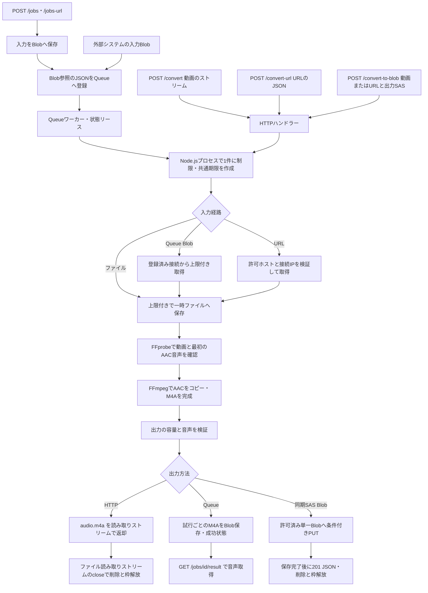

# Movie → Audioの実装

`functions/movie2audio/` は、動画の最初の音声をM4AまたはWAVへ変換する独立したNode.js Functionsプロジェクトです。Node.js 22 / 24、Functions v4のプログラミングモデルを使います。HTTPアップロードと許可済みHTTPS URLに加え、非同期HTTPと直接QueueのBlob入力が共通のFFmpeg抽出処理を呼びます。同期の結果はHTTPの音声ストリーム、または単一BlobのSASによる保存後のJSONで返します。非同期は登録済みStorageにM4Aを保存し、ジョブIDで状態・結果を取得します。他のJava製Function Appとは別にビルド・設定・配置します。

API利用方法は[利用ガイド](../functions/movie2audio/docs/usage.md)と[HTML API資料](APIDocs/movie2audio/index.html)を参照してください。

## 処理の流れとストリーミング



`src/index.js` の `app.setup({ enableHttpStream: true })` で、[Node.jsのHTTPストリーミング](https://learn.microsoft.com/en-us/azure/azure-functions/node-http-stream)を有効にします。アップロードは `request.body` から上限付きでディスクへ流し、応答は完成済みの音声ファイル（M4A/WAV）の読み取りストリームを返します。入力・出力ファイル全体を `arrayBuffer()` や `readFile()` でメモリーへ読み込まないでください。小さいURL JSONと画面アセットは別です。

抽出を完了してからレスポンスを開始します。AACは `-c:a copy` でコピーし、元のサンプリングレート・チャンネル数を保持します。ローカルのM4Aへ出力し、`-movflags +faststart` で再生情報（`moov`）を音声データ（`mdat`）より前へ移します。抽出と送信を同時に進めるライブ変換ではなく、fragmented MP4も使いません。

FFmpegにはユーザーのURLやファイル名を渡しません。アプリが作成したローカルパスと固定のコマンド引数だけを使います。同期HTTPとQueue処理に同じ入力上限・出力上限・音声選択を適用します。同期のダウンロード用2APIは音声応答、SAS保存用APIはJSON応答です。URL本文は最大16KiBで読み込み、空でない文字列の `url` だけを持つJSONオブジェクトを受け付けます。重複キー・未知のキー・末尾の別のJSON値は拒否します。

## モジュールの役割

以下のパスは `functions/movie2audio/` 内です。

| 場所 | 担当 |
| --- | --- |
| `src/index.js` | Functions v4の登録、Function認証・匿名公開の指定、HTTPストリーミングの有効化 |
| `src/handlers.js` | ボディ形式、URL JSON、実行枠・期限、一時作業領域、ストリーム入出力と終了処理 |
| `src/admission.js` | HTTPとQueueが共有するプロセス内の実行枠 |
| `src/job-request.js` | 48KiBの厳密なUTF-8 JSON契約、ID・Storage登録・Blob名の正規化 |
| `src/job-store.js` | Azure Blob/Queue接続、入力保存・上限付き取得、条件付き状態・結果保存、リース |
| `src/jobs.js` | Queueワーカーとpoison処理、重複排除、期限・リース更新、再試行 |
| `src/playground.js` | Playground、画面アセット、公開設定API |
| `src/config.js` | 環境変数、既定値、数値の範囲検証、URL機能の有効状態 |
| `src/errors.js` | HTTPステータス・公開エラーコード・安全なメッセージ |
| `src/url.js` | HTTPS/443・完全一致ホスト・公開IPの検証、検証済みIPへの接続、上限付き取得 |
| `src/blob.js` | 単一Blob SAS・保存先ホストの検証、条件付きPUT、SASを除く保存結果 |
| `src/ffmpeg.js` | バイナリのSHA-256照合・展開、子プロセスの期限と出力制限、FFprobe検証、AACコピー |
| `resources/ffmpeg/` | Linux x64・macOS Apple SiliconのFFmpeg / FFprobeとmanifest・チェックサム |
| `resources/playground/` | ビルド不要のHTML・CSS・JavaScript |
| `test/fixtures/` | 自作の動画・音声テスト入力 |
| `scripts/patch-sdk.mjs` | 固定バージョンのFunctions SDKに対するHTTPストリーム互換修正・SHA-256検証 |

## 変更時に守る契約

- 「AACをそのまま取り出す」は `-c:a copy` による動作です。非AACを自動変換する変更は別の変換モードとして設計し、無言で追加しないでください。
- 音声の選択は最初の音声トラックで固定します。後続トラックへの自動切り替えは利用者が期待する音声を変えてしまいます。
- 出力は通常のM4Aで、ADTSの `.aac` ファイルと同一の仕様として扱いません。`moov` を `mdat` より前へ置き、コンテナーの配置とAACパケットの保持を別々に検証します。
- 動画ストリームを必須とし、カバー画像だけの音声ファイルを動画として扱いません。
- 既存APIのパス・Function認証・エラーJSON・従来の公開設定フィールドを維持し、非同期の有効状態 `asyncEnabled` を加えます。新しい `/convert-to-blob` もFunction認証を使い、201 JSONを返します。入力・出力の許可リスト、キー、署名付きURLは公開設定・応答・ログへ出しません。
- 同期の入力受信・抽出・HTTP応答への出力ファイル読み出しで同じ期限を使います。応答ストリームを作った時点で実行枠や作業ファイルを解放しないでください。枠を保持する終点はファイル読み取りストリームの `close` で、クライアントの受信完了ではありません。

## URL取得の境界

`CONVERSION_URL_ALLOWED_HOSTS` は完全一致のDNSホスト名です。HTTPS・443番ポートの直接ファイルURLだけを許可し、URL内認証・フラグメント・リダイレクト・圧縮応答を拒否します。許可ホストを解決した全IPを検証し、内部・ループバック・リンクローカル・予約済みアドレス・Azureプラットフォームアドレスを拒否します。実際の接続にも検証済みIPを使い、ホスト名に対するTLS証明書検証を維持します。

プロキシ・Cookie・自動リトライは使わず、利用者のFunctionキーや任意ヘッダーを取得先へ転送しません。FFmpegにURLを渡さず、ネットワークを無効にした同梱バイナリへローカルファイルを渡します。ダウンローダーを単純な `fetch(url)` へ置き換えると、DNS検証と接続の一貫性やリダイレクト制御を失うため、同じ境界を満たす実装にしてください。

取得処理を変更した場合は、IPv4/IPv6表記、内部アドレス、DNSの混在結果、リダイレクト、期限、サイズ制限、プロキシ環境変数の影響を確認します。新たなURL認証方式や任意ヘッダーの受付は、既存の許可リスト設定とは別の変更として検討します。

## SASを使うBlob保存の境界

`POST /api/convert-to-blob` は同期処理です。URL入力は `{"input":{"url":"..."},"output":{"sasUrl":"..."}}` のJSON、直接アップロードは `request` に `{"output":{"sasUrl":"..."}}` のJSONファイル、`file` に動画ファイルを持つmultipartだけを受け付けます。両パートにファイル名が必要で、テキストフィールドは拒否します。JSONは生のUTF-8を検証します。JSONの余分なキー・重複キーや余分なパートを拒否し、動画全体をメモリーに読み込む `request.formData()` は使いません。JSON入力全体は32KiB、multipartのJSONファイルは16KiB、multipart本文全体は入力動画上限 + 64KiBで制限します。ファイル本体にも入力動画上限を適用します。ホスト上限はmultipartの追加容量を含めて設定します。既存の `/convert` の生バイト列契約、`/convert-url` の単一url JSON契約を変更しません。

管理者が `CONVERSION_OUTPUT_ALLOWED_HOSTS` で許可した `<account>.blob.core.windows.net` だけに書き込みます。未設定ならこのAPIを無効にします。入力用の許可リストと独立させ、入力先を許可しただけで出力も許可することはありません。SASは単一Blob（`sr=b`）限定、権限は `c` / `w` / `cw`、HTTPS限定、明示的な有効期限と署名が必須です。受け付けるSASクエリを限定し、アカウントSAS・コンテナーSAS・任意のHTTPヘッダー・接続文字列・アカウントキーを受け取りません。署名そのものの認証はAzure Storageが行います。

保存先にも公開IP検証、検証済みIPへの接続、ホスト名のTLS検証、リダイレクト・プロキシ・自動リトライ禁止を適用します。SASやStorageが返すエラー本文をアプリの公開エラー・ログへ出さないでください。ユーザー指定URLをそのままログに残す例外やHTTPクライアントへの置換は、この保証を壊します。

完成したM4Aをディスクから単一の `Put Blob` で送信し、`x-ms-blob-type: BlockBlob`、選択形式のContent-Type（audio/mp4またはaudio/wav）、`If-None-Match: *`を設定します。既存Blobへ上書きせず、前提条件エラーは `409 OUTPUT_BLOB_EXISTS` とします。SASのBlobパスが保存名そのもので、コンテナー作成・パス自動生成・保存済みBlob削除は行いません。返却する `blobUrl` からクエリを除き、バイト数・Content-Type・ETagとAAC copyの情報だけを返します。

入力・抽出・アップロードで共通期限と同時実行枠を保持し、PUT成功を確認してから一時ファイルを削除して201 JSONを返します。失敗時もローカルの作業領域を片付けます。アップロード後の通信切断は保存の有無が不明になり得るため、失敗後のHEAD・自動再送・削除を追加しないでください。呼び出し元が保存名を一意にし、自分の権限で保存先を確認します。

テストではSASの範囲・権限・有効期限・未知クエリ、保存先ホストとIP、条件付きPUTのヘッダー、完成音声のバイト列、期限・通信切断・拒否応答、SASの非公開、ファイル削除と実行枠解放を確認します。HTTPS接続設定の検証と、テスト専用のローカルHTTP受信先への転送成功は、Azure Storage実サービスでの検証とは別です。実Functionsホストのテストでは、JSON・multipart・チャンク送信の入力検証までを確認し、実際のBlobへ書き込みません。[API仕様と呼び出し例](APIDocs/movie2audio/storage.html)を参照してください。

## 非同期受付・Queue処理の契約

`POST /api/jobs` は生バイト列、`POST /api/jobs-url` は厳密な単一url JSONを受け付けます。URLは受付中に取得し、動画を制御用Storageへ保存してからBlob参照をQueueへ送ります。入力上限を受付とワーカーの両方で検証し、FFprobeによるメディア検証・AAC抽出はワーカーで行います。202の成功はQueueへの登録完了を意味し、抽出成功ではありません。

`CONVERSION_STORAGE_CONNECTION_STRING` があるときだけQueueトリガーを登録します。Node.jsの登録はこの設定を接続名として直接参照します。Javaのような未設定接続用のダミー値や別名設定は必要ありません。`AzureWebJobsStorage` はホスト用で、機能のオン／オフとは別です。

直接QueueもHTTP受付も、version1または2・UUID・入出力Blobを持つ同じ正規化済み依頼を処理します。外部JSONはデコード後48KiB以下の正しいUTF-8に制限し、未知キー・重複キー・型違い・末尾データを拒否します。QueueはBase64を1回デコードしてワーカーへ渡します。トリガーは `dataType: 'binary'` とし、Bufferを独自の厳密なパーサーへ渡します。SDKによるJSONの自動オブジェクト化に変えると重複キーの情報が失われるため、この指定を維持してください。URL・SAS・資格情報をJSONに追加せず、`CONVERSION_INPUT_STORAGE_{NAME}` と `CONVERSION_OUTPUT_STORAGE_{NAME}` に登録した接続を名前で参照します。入力・出力の登録を混用しないでください。

状態は制御用の `movie2audio-jobs/{jobId}/status.json` に `job`・`request`・`result` を記録します。同じUUIDに異なる正規化済み依頼が届いても既存状態を変更せず、成功／失敗済みの同一依頼は再実行しません。再実行する利用者は新しいUUIDと入力Blobを用意します。リースを定期更新して同じジョブを排他制御し、失効・所有権喪失時に古い処理が状態を確定しないようにします。

ワーカーは動画を一時ディスクへ上限付きで取得し、同期と同じFFmpegと検証でM4Aを完成させます。出力は `{prefix}/{jobId}/results/{attemptUUID}/audio.m4a` に条件付きで保存し、保存が完了した試行だけを成功として記録します。結果を指す `result` は `storage`・`container`・`blobName`・`contentType`・`filename`・`sizeBytes`・`etag` を持ちます。複数試行やクラッシュ時の未公開Blobがあり得るので、パス推測ではなく成功状態のdescriptorを使います。

`GET /api/jobs/{id}` は `job` と相対の `statusUrl`、成功時だけ `resultUrl` を返し、内部request/resultやStorage登録先は返しません。`GET /api/jobs/{id}/result` は保存した音声を取得し、Function認証の音声ストリームとして返します。出力接続には読み取り権限も必要です。SASを発行・返却する機能ではありません。ジョブIDとFunctionキーは利用者別の認可モデルを提供しません。

一時的なStorage障害や実行枠の競合は再試行し、恒久的な入力不備・形式不備・上限超過は失敗状態にします。Queueの `maxDequeueCount` は10、`visibilityTimeout` は1分です。`movie2audio-jobs-poison` は有効な依頼に対して失敗を記録します。不正JSON・UUIDなど解析できない依頼には状態を作れない場合があります。直接Queue投入直後の404と、処理できないメッセージによる404を運用で区別してください。

Node.jsプロセス内の実行枠は同期変換とQueue処理で共有します。`batchSize=1`・`newBatchThreshold=0`・動的同時実行無効は、複数インスタンス全体を1件に制限する設定ではありません。水平スケール時に並列で処理でき、厳密なFIFOや処理回数1回の保証はありません。

受付・ワーカー各試行・結果取得はそれぞれ既定180秒の期限を持ち、キュー待機時間を含みません。Storageの保持は既定で無期限です。保持設定を有効にすると所有記録に基づいてアプリ生成物のみを清掃します。一時ディスクは成功・失敗・期限切れのすべてで後片付けします。

Playgroundは公開設定の `asyncEnabled` でキュー実行を制御し、3秒間隔・最大15分の状態確認と結果取得を行います。キーはメモリー内だけに持ち、状態／結果URLは同一オリジンかつ該当ジョブの期待パスと完全一致するものだけを使います。API応答の任意URLへFunctionキーを転送しないでください。画面の待機終了は受付済みジョブのキャンセルではありません。

Queueの詳細と送信サンプルは [直接Queue手順](../functions/movie2audio/docs/direct-queue.md)、HTTP契約は [非同期API資料](APIDocs/movie2audio/jobs.html) を参照してください。

## リソースと後片付け

リクエストごとに作る一時ディレクトリへ `input.bin` と `audio.m4a` を置きます。入力受信・URL取得・抽出・HTTP応答へのファイル読み出し、またはBlob保存完了を合わせた既定期限は180秒、設定できる最大は210秒です。Node.jsプロセス内の実行枠は1件で、競合は `503 CONVERSION_BUSY` です。複数インスタンス全体を1件に制限するものではありません。

音声を返す成功経路は、出力ファイルの読み取りストリームが `close` したときに作業ディレクトリを削除し、実行枠を解放してタイマーを止めます。これは、ファイルからSDKへ渡すデータの消費が終わったか、エラー・伝搬したキャンセル・期限超過で読み取りが終了したことを表します。処理失敗時も後片付けを通します。読み取りストリームがファイルを使っている間は、成功経路の `finally` で先に削除しないでください。

この `close` はクライアントが全バイトを受信した証拠ではありません。SDKやFunctionsホストのバッファに残ったデータがネットワークへ流れ切るまでを、同じ180秒のタイマーでは管理しません。ホスト側の `functionTimeout` は別に4分です。また、応答ストリームの開始前のクライアント切断は、進行中のURL取得やFFmpegへ直ちに伝搬するとは限りません。継続する処理は共通期限で制限します。

レスポンス開始前の失敗はJSONで返せますが、開始後はステータスや本文をJSONへ変更できません。ファイル読み出し中のエラーは応答ストリームを失敗させます。アプリは `Content-Length` を付けず、途中までの応答を正常終了させない構成です。利用側にもHTTPステータスだけでなく、本文の読み取り完了を確認してもらいます。

アプリのストリームバッファとFFmpeg / FFprobeのメモリーはインスタンスのRAMを使います。一時ディスクには入力と出力を同時に置くため、容量上限を変更するときはディスク容量も確認します。Node.jsへの移行だけで、ファイルサイズや処理時間の上限がなくなるわけではありません。

同梱バイナリの展開領域は、リクエストごとの作業領域とは別にプロセス内で再利用します。所有者のみアクセスできる場所へ展開し、終了時に削除を試みます。強制終了時の削除は保証できないため、永続保存先にはしません。

## SDK互換修正の保守

`@azure/functions` は4.16.2に固定しています。`scripts/patch-sdk.mjs` はSDK内部の `sendProxyResponse` を `stream.pipeline()` に接続する実装へ置き換え、転送先が詰まったときに読み出しを待つ動作と、HTTPプロキシが閉じたときの入力ストリームの終了を維持します。また `createStreamRequest` は実際のHTTPヘッダーを使うよう修正し、JSON本文にある `headers` フィールドで `Content-Type` や `Content-Length` を上書きできないようにします。SDKの著作権表示・MITライセンスは保持します。

互換修正は `npm ci` の `postinstall` で適用し、`npm start` でも確認します。`npm run package` は `--ignore-scripts` による本番依存のインストール後に明示的に適用し、修正スクリプトも配布物へ含めます。スクリプトはSDKのバージョン・エントリーポイント・修正前後のSHA-256を確認し、既に適用済みなら再確認だけを行います。未知のバージョンや内容ではインストール・起動・パッケージ作成を停止します。依存を更新するときはSDK本体の変更を読み、修正の要否とハッシュを見直したうえで、送信量制御・キャンセルの伝搬・本文からのヘッダー上書き拒否をテストと実ホストで再確認してください。

## ビルドと検証

```bash
cd functions/movie2audio
npm ci
npm test
npm run package
```

Node.js 22または24を使い、`.nvmrc` は24を指定します。配布物は `dist/` に作成し、実行用ソース・アセット・本番用依存パッケージと、FFmpegのソース・ライセンス・ビルドスクリプトを含めます。JDK・Mavenは不要です。ローカルは `npm start` または `python3 scripts/run_local.py` で起動します。どちらもPythonの起動スクリプトを使うため、Python 3.10以上が必要です。Python版の `--skip-build` は依存インストールの省略を意味します。

起動済みホストに対する確認は `python3 scripts/test_http_e2e.py` を使います。音声選択、AACパケットの保持、M4Aのボックス順序、メタデータ除去、期限・出力上限、URL制限、HTTPの正常・異常応答に加え、入力・出力へ伝搬したキャンセルや、出力ファイルの読み取りストリームが閉じるまでの実行枠保持を確認します。macOS、Linux x64バイナリ、Azure配置の検証は区別します。

同梱FFmpegの出典と再ビルドは [third-party/ffmpeg/README.md](../functions/movie2audio/third-party/ffmpeg/README.md) にまとめています。実行ファイルだけ置き換えず、対応するソース・ライセンス・manifest・チェックサムもそろえて更新してください。

Movie2Audioは音声をHTTPで返すか、指定されたBlobへ保存するところまでを担当します。Azure Speechなどへの送信・文字起こしは利用側の処理で、Movie2Audioにはその接続設定やサービス呼び出しを追加していません。

コード・API契約を変更したら、[利用ガイド](../functions/movie2audio/docs/usage.md)、設定例、[HTML API資料](APIDocs/movie2audio/index.html)、このガイドを合わせて更新します。

## 追加された変換・外部連携

`src/audio-options.js` がcopy/transcode、m4a/wav、サンプルレート・チャンネル数の許可範囲を正規化します。`extractAudio`は同じ設定をHTTP・Queueから受け取り、固定の引数配列だけで実行します。AACコピーはパケットのSHA-256一致、形式変換は実ファイルのコーデック・レート・チャンネルとWAVのPCM内容を検証します。Linux x64版はネットワークを無効にしたコンテナーでも同じテストを実行します。

接続文字列とMIの選択、version 2の期待ETag・付加情報・結果通知、永続的な通知送信待ち、所有成果物の保持を実装しています。具体的な契約は[直接Queueガイド](../functions/movie2audio/docs/direct-queue.md)、ホスト認証・ネットワーク・運用上の境界は[配置手順](development.md#8-managed-identity閉域storage結果通知)を参照してください。文字起こしは音声生成の成功条件に含めません。
