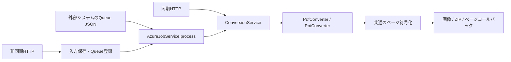

# PowerPoint / PDF → 画像の実装

[マニュアルの入口](README.md) · [共通の作業手順](development.md)

対象は [`functions/ppt-pdf-to-images`](../functions/ppt-pdf-to-images/) です。PPTX・PPT・PDFをPNG／JPEGへ変換する、独立したAzure Functionsアプリです。
変換コアはAzureに依存しませんが、Maven Central向けの独立ライブラリとしては公開していません。

起動・デプロイ・HTTP API・設定の一覧は[機能README](../functions/ppt-pdf-to-images/README.md)、QueueのJSON契約・認証・保存先は[直接Queue連携](../functions/ppt-pdf-to-images/docs/direct-queue.md)を参照してください。

## 責務とソースの対応

Javaのパッケージは `com.slide2image` のままです。主な変更箇所は次のとおりです。

| ソース | 責務 |
| --- | --- |
| [ConversionFunctions](../functions/ppt-pdf-to-images/src/main/java/com/slide2image/ConversionFunctions.java) | HTTP・Queueトリガー、リクエスト解析、レスポンス・安全なエラーへの変換。内部の`RuntimeServices`が設定・変換サービスを共有する |
| [AppConfig](../functions/ppt-pdf-to-images/src/main/java/com/slide2image/AppConfig.java) | 環境変数から上限・Storage設定を構築。非同期の有効条件を判定する |
| [ConversionService](../functions/ppt-pdf-to-images/src/main/java/com/slide2image/conversion/ConversionService.java) | 共通の検証・形式選択・変換排他・画像エンコード・ZIP・ページ単位コールバック |
| [InputConverter](../functions/ppt-pdf-to-images/src/main/java/com/slide2image/conversion/InputConverter.java) | 入力形式ごとの内部契約。文書を開いたまま共通エンコーダーへページ描画関数を渡す |
| [PptConverter](../functions/ppt-pdf-to-images/src/main/java/com/slide2image/conversion/PptConverter.java) | POIでPPTX／PPTを解析し、スライドを描画する |
| [PdfConverter](../functions/ppt-pdf-to-images/src/main/java/com/slide2image/conversion/PdfConverter.java) | PDFBoxでPDFを解析し、ページを描画する |
| [PageRendering](../functions/ppt-pdf-to-images/src/main/java/com/slide2image/conversion/PageRendering.java) | 物理寸法からピクセル寸法を計算し、画素数を検証。白背景と描画品質を設定する |
| [ConversionOptions](../functions/ppt-pdf-to-images/src/main/java/com/slide2image/conversion/ConversionOptions.java)・[ConversionLimits](../functions/ppt-pdf-to-images/src/main/java/com/slide2image/conversion/ConversionLimits.java)・[ConversionResult](../functions/ppt-pdf-to-images/src/main/java/com/slide2image/conversion/ConversionResult.java) | オプション・上限・符号化済み`byte[]`とMIME／ファイル名／出力枚数の受け渡し |
| [AzureJobService](../functions/ppt-pdf-to-images/src/main/java/com/slide2image/jobs/AzureJobService.java) | ジョブ受付、状態遷移、重複依頼の判定、変換と保存の順序、再試行対象の分類 |
| [JobStore](../functions/ppt-pdf-to-images/src/main/java/com/slide2image/jobs/JobStore.java)・[AzureJobStore](../functions/ppt-pdf-to-images/src/main/java/com/slide2image/jobs/AzureJobStore.java) | 保存処理の境界とAzure実装。Blob・Queue・lease・結果の保存と取得を扱う |
| [ConversionJobRequest](../functions/ppt-pdf-to-images/src/main/java/com/slide2image/jobs/ConversionJobRequest.java)・[BlobStorageProfiles](../functions/ppt-pdf-to-images/src/main/java/com/slide2image/jobs/BlobStorageProfiles.java) | Queue JSONの厳密な解析・既定値補完と、入力／出力別Storage登録の解決 |

## 入力検出から描画まで

`ConversionService.validate()`は入力容量、オプション、基本シグネチャを確認します。非同期HTTPの受付でも使いますが、文書の詳細解析はワーカーでの変換時に行います。
拡張子やHTTPのContent-Typeを形式判定の根拠にしてはいけません。

1. `ConversionService`は登録順に`InputConverter.supports()`を呼び、PDF、PowerPointの順で候補を選びます。
2. `PdfConverter`は先頭付近の`%PDF-`を検出し、`Loader.loadPDF()`で解析します。パスワード不要でも暗号化されたPDFは拒否します。
3. `PptConverter`はOOXML／OLE2シグネチャを候補として受け付け、OOXMLではPPTX本体のContent-Type、OLE2では`PowerPoint Document`エントリーを追加確認します。Word等のコンテナーをPPTとして描画しません。
4. 各コンバーターは文書とレンダラーを保持した状態で、総ページ数と`PageRenderer`を共通エンコーダーに渡します。
5. 共通側が総ページ数・指定ページを検証し、必要なページだけを描画・符号化します。APIのページ番号は1始まり、内部の描画インデックスは0始まりです。

`InputConverter.convert()`内でエンコーダーを**同期的に呼び終えてから**文書を閉じます。`PageRenderer`を別スレッドや後続処理に持ち出すと、閉じた文書へのアクセスになるため、この寿命を変えないでください。
各ページは白背景の`TYPE_INT_RGB`画像です。`Graphics2D.dispose()`と、符号化後・失敗時の`BufferedImage.flush()`をそれぞれの所有箇所で行います。

## 同期HTTPとQueueの共通部分

標準の`RuntimeServices`は1個の`ConversionService`をHTTPとQueueで共有します。同じサービス内で別文書の変換が重なると`503 CONVERSION_BUSY`になり、Queueでは再試行されます。
この排他は文書モデル・画像・ZIPの同時保持を抑えるためのものです。ハンドラーごとにサービスを生成して迂回しないでください。複数インスタンス間の排他とは別です。

`AzureJobService`はジョブの初期状態を作成し、lease取得後に依頼内容を照合します。同一内容の完了済みジョブは再変換しません。
変換結果の保存が完了してから成功状態を公開し、Storage障害や5xxはQueueへ再試行を委ねます。文書不正・上限超過等の4xxは失敗状態に記録します。
コールバック内のStorage例外を`INVALID_DOCUMENT`に変換しないため、共通コアには例外を元の呼び出し元へ返す処理があります。

## ZIPと個別画像の出力

| 呼び出し | 動作と保持するデータ |
| --- | --- |
| `convert()`、ページ指定あり | 指定ページだけを符号化し、画像1枚の`ConversionResult`を返す |
| `convert()`、ページ指定なし | 1ページずつ画像化してZIPへ追加する。最終ZIP全体はメモリ内に保持する |
| `convertPages()` | 画像1枚を符号化するたびに`PageConsumer`を同期呼び出しする。過去ページやZIPをコアで蓄積しない |

PNG／JPEGエンコーダー、ページ番号、上限検証は両経路で共通です。`ConversionResult.pageCount`は元文書の総数ではなく、その結果に含む画像枚数です。
全ページのZIP内や個別画像モードの名前は`page-0001.png`等で、ページ指定時にも元ページ番号を使います。

Queueの`output.mode="images"`では、`beginImages()` → `convertPages(..., images::writePage)` → `finish()`の順に呼びます。
Storage実装は1試行分のパスを決め、画像のアップロード完了後にメタデータだけを蓄積し、最後に`manifest.json`を保存します。成功状態の結果参照はmanifestを指します。
`GET .../result`はそのJSONを返します。画像のHTTP個別配信やダウンロード時のZIP生成は実装していません。
再試行には新しい試行UUIDを使います。途中で失敗した画像や未公開のmanifestを既存結果へ混ぜず、残存Blobの保持期限は運用側で管理します。

## 寸法・フォント・資源の境界

`PageRendering.dimensions()`の既定倍率は`96 / 72 × UserUnit`です。PowerPointのUserUnitは1、PDFはページに保存された値を使います。
PDFは各ページのCropBoxと90／270度の回転を反映して幅・高さを求めます。各辺を整数ピクセルへ丸めるため、混在サイズのPDFもページごとに異なる画像寸法になります。
`width`指定時はそのピクセル幅から倍率を計算し、縦横比を維持します。固定のdpi値を変更するオプションではありません。

フォント関連の責務は次のように分かれます。

| ソース | 開発上の注意 |
| --- | --- |
| [BundledFonts](../functions/ppt-pdf-to-images/src/main/java/com/slide2image/conversion/BundledFonts.java) | 同梱Notoのリソース名とゴシック／明朝・通常／太字の分類 |
| [BundledPptFontManager](../functions/ppt-pdf-to-images/src/main/java/com/slide2image/conversion/BundledPptFontManager.java) | 利用可能な元フォントを維持し、欠落したフォント・文字へ同梱フォントを提供 |
| [PptFontDrawFactory](../functions/ppt-pdf-to-images/src/main/java/com/slide2image/conversion/PptFontDrawFactory.java) | POI 5.5.1で代替後の`FAMILY`と`FONT`属性が不整合になる箇所を補正し、代替字幅で再改行する。POI更新時の重点確認箇所 |
| [BundledPdfFonts](../functions/ppt-pdf-to-images/src/main/java/com/slide2image/conversion/BundledPdfFonts.java) | PDFBoxの既存マッピングを包み、日本語CIDの代替だけを追加。埋め込みフォント・既存の非代替マッピング・他の文字集合は維持 |

PDF用mapperはPDF読み込み前に遅延初期化し、プロセス全体へ一度だけ登録します。同梱NotoのCID番号をPDFのAdobe-Japan1番号として直接使わず、Unicodeへ変換する経路を維持してください。
フォントを更新する際は[リソースのREADME・ライセンス・SHA256SUMS](../functions/ppt-pdf-to-images/src/main/resources/fonts/noto/)も合わせて管理します。

容量・ページ数・画素数・出力サイズはアプリの上限です。総ページ数の上限は1ページ指定にも適用し、画像の画素数は割り当て前、符号化サイズは書き込み中に検証します。
個別画像モードは各画像に加え、全画像とmanifestの合計もStorage側で検証します。
入力`byte[]`、解析済み文書、現在ページの画像、符号化済み画像、ZIP経路では最終ZIPがメモリを使います。個別画像モードも入力文書全体の解析は必要です。
POIの描画はPowerPoint本体と完全には一致せず、フォント代替で字幅・改行も変わり得ます。暗号化文書や文字コード情報が失われたPDFの復元には対応しません。実資料の処理時間・メモリは配置先で測定してください。

## 形式を追加・変更するとき

1. ページとして描画する新形式なら`InputConverter`実装を追加し、`ConversionService`の登録リストへ加えます。検出の競合順序と、コンテナー内部の形式確認を設計します。
2. `supports()`は軽い内容判定に留め、詳細な解析・暗号化の扱い・文書の解放を`convert()`に実装します。ページをすべて画像へ展開して保持せず、描画関数を渡します。
3. 寸法は`PageRendering`で計算し、共通側のページ検証・エンコード・ZIP／コールバックを再利用します。通常、形式追加だけでHTTPやStorage実装を複製する必要はありません。
4. 出力形式を追加する場合は、`ConversionOptions`を使う検証、HTTP解析、Queue JSON解析、エンコーダー、`AzureJobStore.ImageBatch`のMIME・拡張子検証、Playgroundの選択肢も確認します。
5. [pom.xml](../functions/ppt-pdf-to-images/pom.xml)の依存関係、必要な配布物・ライセンスを確認し、対応形式と制限を機能READMEへ反映します。

## 変更に対応する検証

| 変更対象 | 既存の検証入口 |
| --- | --- |
| 形式検出・描画・出力 | [ConversionServiceTest](../functions/ppt-pdf-to-images/src/test/java/com/slide2image/conversion/ConversionServiceTest.java)：3形式の実変換、拡張子偽装、暗号化PDF、ページ指定、CropBox／回転／UserUnit、入力・画素・ZIP上限、コールバック順序と失敗後の排他解放 |
| フォント・文字配置 | [JapanesePptFontTest](../functions/ppt-pdf-to-images/src/test/java/com/slide2image/conversion/JapanesePptFontTest.java)・[BundledPdfFontsTest](../functions/ppt-pdf-to-images/src/test/java/com/slide2image/conversion/BundledPdfFontsTest.java)：日本語4書体、埋め込み優先、非埋め込みCID、mapper初期化 |
| HTTP・設定 | [ConversionFunctionsTest](../functions/ppt-pdf-to-images/src/test/java/com/slide2image/ConversionFunctionsTest.java)：入力・オプション、非同期無効時、応答、設定・ログへの秘密情報流出防止 |
| Queue契約・状態遷移 | [ConversionJobRequestTest](../functions/ppt-pdf-to-images/src/test/java/com/slide2image/jobs/ConversionJobRequestTest.java)・[AzureJobServiceTest](../functions/ppt-pdf-to-images/src/test/java/com/slide2image/jobs/AzureJobServiceTest.java)・[BlobStorageProfilesTest](../functions/ppt-pdf-to-images/src/test/java/com/slide2image/jobs/BlobStorageProfilesTest.java)：JSON、旧状態との互換、重複、競合、保存失敗、manifest公開順序 |
| 実Storage・実ホスト | [AzureJobStoreIntegrationTest](../functions/ppt-pdf-to-images/src/test/java/com/slide2image/jobs/AzureJobStoreIntegrationTest.java)・[test_async_e2e.py](../functions/ppt-pdf-to-images/scripts/test_async_e2e.py)。接続を用意して明示実行する手順は機能READMEを参照 |
| Playground | [test_playground_e2e.py](../functions/ppt-pdf-to-images/scripts/test_playground_e2e.py)：実ブラウザーで同期／非同期・エラー・ダウンロードを確認 |

新形式では、正常資料に加えて「似たシグネチャの別形式」「破損・暗号化」「混在寸法」「選択ページ」「上限直前・超過」を追加してください。
描画変更は実行環境のフォント差も影響するため、日本語・太字・明朝・改行を含む実画像で見た目も確認します。ローカルの生成資料による検証結果を、Azure上の性能保証として扱わないでください。
