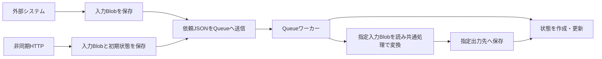

# PowerPoint / PDF to Images

[convertX2X](../../README.md) のPowerPoint／PDF→画像変換Functionです。以下のコマンドは、この機能のフォルダで実行します。

```bash
cd functions/ppt-pdf-to-images
```

PPTX・PPT・PDFをPNGまたはJPEGへ変換するAzure Functionsアプリです。PowerPointにはApache POI、PDFにはPDFBoxを使用します。1つのFunction Appで、同期HTTP・非同期HTTP・外部システムからの直接Queue依頼と共通の変換処理を提供します。

| 利用方法 | 依頼と結果の受け取り方 | アプリ用Storage |
| --- | --- | --- |
| 同期HTTP | ファイルをPOSTし、画像またはZIPをレスポンスで取得 | 不要 |
| 非同期HTTP | ファイルをPOSTし、ジョブIDを受領。状態確認後に結果を取得 | 必要 |
| 直接Queue | 入力Blobを保存し、入出力先を含むJSONをQueueへ送信。状態と結果を取得 | 必要 |

PlaygroundはHTML・CSS・JavaScriptだけの簡易UIです。非同期HTTPも外部システムと同じQueueメッセージを使うため、外部からの依頼にPlaygroundやHTTPアップロードAPIは必要ありません。

直接Queueへ依頼する場合は、全ページをZIPにまとめる保存と、1ページずつ個別の画像Blobへ保存する方法を選べます。

既定の変換は **元のページ寸法を96dpiで画像化し、全ページのPNGをZIPにまとめる** 動作です。入力上限は **20MiB・50ページ** で、環境変数から変更できます。

## 1. ローカルで試す

必要なものはJDK 21、Azure Functions Core Tools v4、Python 3です。Mavenは同梱のWrapperを使用します。初回ビルドにはインターネット接続が必要です。非同期を試す場合は、追加でAzuriteまたはAzure Storageを用意します。

### 同期変換とPlayground

プロジェクトのルートで次を実行します。ビルド・テスト後にFunctionsが起動します。

```bash
python3 scripts/run_local.py
```

[Playground](http://localhost:7071/api/playground)を開き、ファイルを選択またはドラッグ＆ドロップします。

- 同期／非同期、PNG／JPEG、全ページ／1ページを選択できます。
- 初期選択は全ページのZIPダウンロードです。1ページを指定すると画像をプレビューできます。
- 画像サイズは元のスライド・ページ寸法から自動で決まります。
- Storage未設定時は非同期の選択が無効になります。

フロントエンド用サーバーやnpmビルドは不要です。ビルド済みなら `python3 scripts/run_local.py --skip-build` で起動できます。ポートは `--port 7072` のように変更します。

### 非同期も試す

Azuriteを使う場合、別ターミナルで起動しておきます。

```bash
azurite --location /tmp/slide2image-azurite
```

Functionsを起動するターミナルでは、次の接続設定を渡します。

```bash
export CONVERSION_STORAGE_CONNECTION_STRING='UseDevelopmentStorage=true'
python3 scripts/run_local.py
```

Azure Storageを使う場合は、同じ変数にBlob・Queueを利用できる接続文字列を設定します。設定が空または未設定なら非同期機能は無効で、非同期APIは `503 ASYNC_DISABLED` を返します。

### ローカル設定ファイル

設定ファイルが必要なら、次をコピーして `Values` を編集します。

```bash
cp local.settings.example.json local.settings.json
```

`local.settings.json` がなければ [local.settings.example.json](local.settings.example.json) を読みます。同じキーが環境変数にもある場合は環境変数を優先します。実キーを含む `local.settings.json` はGit管理対象外です。

起動スクリプトは非同期の接続設定からQueueトリガーのオン・オフを導出し、ローカルの `AzureWebJobsStorage` が空なら同じ接続を補完します。Core Toolsは通常、ローカルではFunctionキー認証を強制しません。

## 2. HTTP APIで使う

| メソッド・パス | 内容 | 成功時 |
| --- | --- | --- |
| `POST /api/convert` | 同期変換 | `200`：画像またはZIP |
| `POST /api/jobs` | 非同期受付 | `202`：ジョブと状態確認URL |
| `GET /api/jobs/{id}` | ジョブの状態確認 | `200`：状態、成功時は結果取得URLも返す |
| `GET /api/jobs/{id}/result` | 結果取得 | `200`：画像またはZIP。直接Queueの個別画像モードでは保存先一覧のJSON |

Azure上では各APIに `x-functions-key` ヘッダーを付けます。複数エンドポイントで同じキーを使う場合はFunction AppのHostキーを使用します。管理用のmasterキーは不要です。外部から直接Queueを使う場合はStorage側の認証を利用します。

### 入力とオプション

**`Content-Type: application/octet-stream` でファイルのバイト列を直接POSTしてください。** `multipart/form-data` は受け付けません。Java workerでのバイナリ受け渡しを揃えるため、PDFも含めてこのContent-Typeを使用します。確認したCore Tools環境では、`application/pdf` を使うとアプリに到達する前のバインド処理でエラーになりました。

同期・非同期HTTPで同じクエリパラメーターを使います。

| パラメーター | 既定値 | 意味 |
| --- | --- | --- |
| `filename` | `document` | 出力名の元になる名前。省略時は `x-file-name` ヘッダーも利用可能 |
| `format` | `png` | `png` または `jpeg` |
| `page` | 全ページ | 1始まりのページ番号。指定時は画像1枚、省略時はZIP |
| `width` | 元の寸法から自動 | APIで明示した場合のみ指定横幅（px）に拡縮し、縦横比を維持 |

入力形式はファイル内容から判定します。名前だけを変更しても非対応形式は変換できません。受付時に容量・オプション・基本シグネチャを検証し、文書の詳細な解析と描画は変換時に行います。

### 同期変換の例

```bash
# PPTX全スライド → PNGをまとめたZIP
curl --fail-with-body \
  --data-binary @slides.pptx \
  -H 'Content-Type: application/octet-stream' \
  'http://localhost:7071/api/convert?filename=slides.pptx' \
  -o slides.zip

# PDFの2ページ目 → JPEG
curl --fail-with-body \
  --data-binary @document.pdf \
  -H 'Content-Type: application/octet-stream' \
  'http://localhost:7071/api/convert?filename=document.pdf&page=2&format=jpeg' \
  -o page-2.jpeg
```

### 非同期変換の例

```bash
curl --fail-with-body -i \
  --data-binary @slides.pptx \
  -H 'Content-Type: application/octet-stream' \
  'http://localhost:7071/api/jobs?filename=slides.pptx'
```

`202 Accepted` の `Location` ヘッダーとJSONの `statusUrl` が状態確認先です。レスポンスの例：

```json
{
  "job": {
    "id": "f6603efc-2fa8-4466-8d09-6d7c3ed94c18",
    "status": "queued",
    "filename": "slides.pptx",
    "options": { "width": null, "format": "png", "page": null },
    "createdAt": "2026-09-09T00:00:00Z",
    "updatedAt": "2026-09-09T00:00:00Z",
    "pageCount": null,
    "errorCode": null,
    "errorMessage": null
  },
  "statusUrl": "/api/jobs/f6603efc-2fa8-4466-8d09-6d7c3ed94c18"
}
```

`Retry-After` に従って `statusUrl` を確認します。状態は `queued` → `running` → `succeeded` または `failed` です。成功すると `resultUrl` が追加され、そのURLから結果を取得できます。URLは同一ホストに対する相対パスです。

未完了・失敗ジョブの結果取得は409、未知のジョブは404です。変換に失敗した場合は `job.errorCode` と `job.errorMessage` を確認します。Playgroundの待機を停止しても、受付済みジョブの処理は継続します。

## 3. 外部システムからQueueへ直接依頼する

送信側は次の3つを行います。

1. 元のPPTX・PPT・PDFをBlobへアップロードする。
2. 新しいUUIDをジョブIDにし、入力・出力先を指定したJSONをQueue `conversion-jobs` へ送る。
3. ワーカーが作成する状態を確認し、完了後に結果を取得する。



別アカウントの入力元 `source` と出力先 `archive` を使う例です。

```json
{
  "version": 1,
  "jobId": "4b2e32cc-15fb-47b5-9ce3-d825c7a95c67",
  "input": {
    "storage": "source",
    "container": "documents-incoming",
    "blobName": "incoming/4b2e32cc-15fb-47b5-9ce3-d825c7a95c67/presentation.pptx"
  },
  "output": {
    "storage": "archive",
    "container": "images-created",
    "prefix": "exports/slides",
    "mode": "images"
  }
}
```

`storage` を省略すると、入力・出力とも既定のStorageを使用します。`filename` は入力Blob名から補完し、`options` を省略すると元の寸法・全ページ・PNGになります。HTTPと同じ `format`・`page`・`width` を `options` に指定できます。保存方法は `output.mode` で選びます。

| `output.mode` | 全ページを変換 | `options.page` で1ページ指定 |
| --- | --- | --- |
| 省略・`null`・`"zip"` | 従来どおりZIPを保存 | 従来どおり画像1枚を保存 |
| `"images"` | ページごとの画像と `manifest.json` を保存 | 指定ページの画像と `manifest.json` を保存 |

上の例は `images` を指定しています。HTTPアップロードとPlaygroundは従来の保存方法を使います。

Queueに送るJSONはUTF-8で最大48KiBです。Java SDKでは `QueueMessageEncoding.BASE64` を設定し、JSON文字列をSDKで1回だけBase64化します。ファイル本体はBlobに置き、Queueには入れません。バージョン付きJSONのみを受け付け、UUIDだけのメッセージには対応しません。

[JSONの全項目と連携手順](docs/direct-queue.md)、[同一アカウントのJSON例](examples/queue-request.json)、[別アカウントのJSON例](examples/queue-request-cross-account.json)、[個別画像保存のJSON例](examples/queue-request-images.json)、[Javaの送信例](examples/QueueProducer.java)を用意しています。

### 入力・出力・状態の保存先

Queueと状態を管理するStorageを、ここでは「制御用Storage」と呼びます。

| 対象 | HTTPからの非同期依頼 | 直接Queueへの依頼 |
| --- | --- | --- |
| Queue | 制御用Storageの `conversion-jobs` | 同左 |
| 入力Blob | 制御用Storageのコンテナー `conversion-jobs`、`{jobId}/input` | `input.storage`・`input.container`・`input.blobName` |
| 状態Blob | 制御用Storageのコンテナー `conversion-jobs`、`{jobId}/status.json` | 同左。初期状態もワーカーが作成 |
| 出力Blob | 制御用Storageのコンテナー `conversion-jobs`、`{jobId}/results/{attemptUUID}/{出力名}` | 指定した出力Storage・コンテナー内の `{prefix}/{jobId}/results/{attemptUUID}/{出力名}` |

`prefix` が空なら先頭の `{prefix}/` は付きません。保存パスを推測せず、状態Blobの `result.storage`・`result.container`・`result.blobName` から結果を取得してください。HTTPの状態確認・結果取得APIも直接Queueのジョブに利用できます。

個別画像モードでは、1回の試行に属する画像と一覧を同じパスに保存します。

```text
exports/slides/{jobId}/results/{attemptUUID}/
  page-0001.png
  page-0002.png
  manifest.json
```

この場合、状態Blobの `result` は `manifest.json` を指します。`GET /api/jobs/{id}/result` でもこのJSONを取得できます。JSONの `images` 配列には各画像の `page`、`storage`、`container`、`blobName`、`contentType`、`filename`、`sizeBytes` が入るので、そのBlob参照から必要な画像を取得します。HTTPでの個別画像配信APIや、取得時のZIP作成は行いません。

全画像とmanifestを保存してからジョブを `succeeded` にします。処理途中の画像一覧は成功結果として公開しません。失敗した試行の画像がBlobに残る場合は、再試行の結果と別パスに分かれます。

Queue登録直後はワーカーがまだ状態を作成しておらず、状態BlobやHTTPの状態確認が404になることがあります。その場合は待って再取得します。入力Blobはジョブごとに一意の名前にし、処理完了まで上書き・削除しないでください。

### 別Storageの登録と権限

接続文字列をFunctionsの環境変数に事前登録します。QueueのJSONからURL・接続文字列・キー・SASを指定する機能はありません。

| 環境変数 | 役割 | JSONでの指定 |
| --- | --- | --- |
| `CONVERSION_STORAGE_CONNECTION_STRING` | 制御用Storageと既定の入出力 | `default` または `storage` 省略 |
| `CONVERSION_INPUT_STORAGE_SOURCE` | 追加の入力用Storage | `input.storage: "source"` |
| `CONVERSION_OUTPUT_STORAGE_ARCHIVE` | 追加の出力用Storage | `output.storage: "archive"` |

登録名は任意です。JSONでは `[a-z][a-z0-9_]{0,31}`、環境変数の末尾ではその大文字表記を使います。`default` は予約名です。入力・出力の登録は分離され、未登録の名前や入力専用の名前を出力に指定した依頼は失敗になります。追加の登録だけでは非同期機能は有効にならず、制御用Storageの設定が必要です。

登録はアカウント単位です。Queueへの送信権限は、登録済みの入力を変換し、登録済みの出力先へ保存してよいシステムに限定します。入力専用という登録はアプリ内の用途制限であり、接続文字列自体のStorage権限を変更しません。接続に与える権限も用途に合わせて制限してください。

## 4. 画像サイズと出力ファイル

PowerPointのスライドが幅10インチ・高さ7.5インチなら960×720px、幅13⅓インチ・高さ7.5インチなら1280×720pxになります。PDFはページごとのCropBox・回転・UserUnitを反映します。各辺を最も近い整数ピクセルへ丸めるため、混在するページサイズにも対応します。

| 指定例 | 出力名の例 | 内容 |
| --- | --- | --- |
| `filename=slides.pptx`、ページ指定なし | `slides.zip` | `page-0001.png`、`page-0002.png`、… |
| `filename=slides.pptx&page=2` | `slides-page-0002.png` | 2ページ目の画像1枚 |
| `filename=slides.pptx&format=jpeg` | `slides.zip` | `page-0001.jpeg`、`page-0002.jpeg`、… |
| Queueの `output.mode: "images"` | `page-0001.png`、`page-0002.png`、`manifest.json` | 画像を別々のBlobとして保存。ページ指定時は元のページ番号を使用 |

ZIPと従来の1ページ画像では、出力名の元になる拡張子を除き、英数字・`_`・`-`以外は `_` に置換します。元の名前部分は最大100文字です。個別画像モードの画像名は元のファイル名によらず `page-0001.png` のような連番です。

## 5. 上限と実行環境の設定

| 環境変数 | 既定値 | 意味 |
| --- | --- | --- |
| `CONVERSION_MAX_INPUT_BYTES` | `20971520` | 入力上限20MiB。バイト単位 |
| `CONVERSION_MAX_PAGES` | `50` | 文書全体のページ数上限。1ページ指定の変換にも適用 |
| `CONVERSION_MAX_PIXELS_PER_PAGE` | `16000000` | 出力画像1枚の画素数上限 |
| `CONVERSION_MAX_OUTPUT_BYTES` | `104857600` | 出力上限100MiB。各画像・最終ZIP、個別画像モードでは全画像とmanifestの合計にも適用 |
| `AzureWebJobsStorage` | ローカルでは空なら制御用Storageを補完 | Functionsホスト用。本番はFunction App側で設定 |
| `JAVA_OPTS` | 起動スクリプト・Maven設定は `-Djava.awt.headless=true` | GUIなしで画像を描画 |

容量・ページ数・画素数の設定は、空または未設定なら既定値を使います。不正な数値は起動エラーになります。これらは**このアプリが設けている上限**で、POI・PDFBoxや4GBプランのファイル上限ではありません。HTTPとQueueで共通に適用し、Playgroundにも入力容量とページ数を表示します。

100MiB・300ページに変更してローカルで起動する例：

```bash
CONVERSION_MAX_INPUT_BYTES=104857600 \
CONVERSION_MAX_PAGES=300 \
python3 scripts/run_local.py
```

実行中の入力ファイル・文書モデル・描画画像はJavaプロセスのメモリを使います。ページ画像は1枚ずつ処理して解放します。ZIP保存ではZIP全体をメモリに保持しますが、個別画像モードでは画像を1枚ずつBlobへ保存し、一覧用のメタデータだけを蓄積します。入力文書の解析はどちらも1回です。4GBインスタンスではこれらも4GBの枠内に含まれ、待機中のファイルはBlobに保存されます。

入力容量だけでは処理時間やピークメモリは決まりません。埋め込み画像・ページ数・描画内容・フォントによって変わるため、上限の引き上げ時は実資料で測定してください。

## 6. Azureで動かす

Functions v4 / Java 21の既存Function Appへ配置します。4GBの従量課金構成ではFlex Consumptionを想定しています。ビルド成果物は次で生成します。

```bash
./mvnw package
```

既定の出力先は `target/azure-functions/slide2image-local/` です。ローカル起動・テストのコマンドはAzureリソースを作成したり、デプロイしたりしません。

### 接続設定と非同期のオン・オフ

Azure CLIでログインし、`CONVERSION_STORAGE_CONNECTION_STRING` を環境変数に読み込んだ状態で実行します。

```bash
python3 scripts/configure_azure_async.py \
  --resource-group YOUR_RESOURCE_GROUP \
  --name YOUR_FUNCTION_APP
```

このコマンドは**指定したAzureアプリの設定を更新します**。更新対象は制御用接続と次の派生3設定、合計4設定です。未設定・空の接続で実行すると非同期を無効にします。

| 派生設定 | 制御用接続が空・未設定 | 制御用接続あり |
| --- | --- | --- |
| `CONVERSION_QUEUE_CONNECTION_STRING` | `UseDevelopmentStorage=true` | 制御用接続と同じ値 |
| `AzureWebJobs.ProcessConversion.Disabled` | `true` | `false` |
| `AzureWebJobs.PoisonConversion.Disabled` | `true` | `false` |

Queue bindingはJavaコードより先に初期化されるため、無効時にも形式上有効なエミュレーター接続を設定します。無効時はリスナーを起動しません。手動設定では制御用接続とこの3設定を揃えてください。ローカル起動スクリプトは同じ設定を自動導出します。

**追加の入力・出力Storage、容量・ページ数の上限、`AzureWebJobsStorage` はこの設定スクリプトの更新対象外です。** Function Appの環境変数へ別途設定してください。既存の対象外設定は保持します。スクリプトは接続文字列をコマンド引数や標準出力へ出しません。Azureの設定変更にはホスト再起動が伴います。

### Flex Consumption 4GBの同時実行と水平スケール

[host.json](host.json) はQueueの `batchSize: 1`、`newBatchThreshold: 0`、`dynamicConcurrencyEnabled: false` を指定し、各インスタンスの変換キューワーカーを1件ずつ動かします。Javaプロセス内の変換も同時に1件に制限しています。

Queue変換ワーカーのオンデマンドインスタンスを最大1台にする設定例：

```bash
az functionapp scale config set \
  --resource-group YOUR_RESOURCE_GROUP \
  --name YOUR_FUNCTION_APP \
  --instance-memory 4096 \
  --maximum-instance-count 1

az functionapp scale config set \
  --resource-group YOUR_RESOURCE_GROUP \
  --name YOUR_FUNCTION_APP \
  --trigger-type http \
  --trigger-settings perInstanceConcurrency=1

az functionapp scale config show \
  --resource-group YOUR_RESOURCE_GROUP \
  --name YOUR_FUNCTION_APP
```

`ProcessConversion` のAlways readyを使っていないことも確認します。既に設定しており、Queueワーカー全体を最大1台にしたい場合は対象エントリーを削除します。

```bash
az functionapp scale config always-ready delete \
  --resource-group YOUR_RESOURCE_GROUP \
  --name YOUR_FUNCTION_APP \
  --setting-names function:ProcessConversion
```

水平スケールする場合は `--maximum-instance-count` を必要な台数に増やします。例えば3台までスケールすれば、各台1件ずつ最大3件を処理できます（Always readyなしの場合）。4GBは1台あたりで、1件の処理メモリを複数台で共有する構成ではありません。

Flexの上限は関数グループごとのオンデマンドインスタンスに適用され、Always readyは別枠です。HTTPとQueueは別グループなので、上限1でも同期HTTP変換とQueue変換は別インスタンスで同時に動作できます。[Azureのスケール仕様](https://learn.microsoft.com/en-us/azure/azure-functions/event-driven-scaling#limit-scale-out)

HTTPも同時実行を1件に設定します。`host.json` のHTTP待機上限は8件で、超過時は429を返す設定です。同じJavaプロセスで変換が競合した場合は `503 CONVERSION_BUSY` になり、Queue処理では再試行します。[HTTPの同時実行設定](https://learn.microsoft.com/en-us/azure/azure-functions/flex-consumption-how-to#set-http-concurrency-limits)

## 7. 再試行・公開範囲・運用上の注意

### ジョブの再送と失敗

- 同じジョブID・同じ依頼内容の再送では、完了済みの変換を繰り返しません。同じIDで異なる依頼を送っても既存ジョブを変更しません。新しい変換には新しいIDを使います。
- Blob leaseを更新して同じジョブの処理を排他制御します。出力先には試行ごとのUUIDを含め、古い試行が結果を上書きすることを防ぎます。
- 不正文書・上限超過・未登録Storage・入力Blobなしなどは失敗状態に記録します。Storage障害や処理の競合はQueue側で再試行します。
- 本プロジェクトはQueueの `maxDequeueCount: 10`、失敗後の `visibilityTimeout: 1分` を設定しています。再試行を使い切ると `conversion-jobs-poison` のワーカーが失敗状態に更新します。不正なJSONやUUIDでは状態を作成できません。[Queueの設定仕様](https://learn.microsoft.com/en-us/azure/azure-functions/functions-bindings-storage-queue#hostjson-settings)
- Storage Queueは厳密な到着順を保証しません。1件ずつ処理する構成でも、再試行などで順序が入れ替わることがあります。[Queueの仕様](https://learn.microsoft.com/en-us/rest/api/storageservices/queue-service-rest-api)

### 認証と保存データ

Playgroundの画面・アセット・`GET /api/playground/config` は匿名公開です。公開設定に含むのは非同期の有効状態・入力容量上限・ページ数上限だけです。変換・状態確認・結果取得APIにはFunctionキー認証を使います。

Playgroundに入力したキーはページ内のメモリで保持し、URLやブラウザーの永続ストレージには保存しません。Storageの接続設定はサーバー側だけで扱います。

新規作成するBlobコンテナーは非公開です。既存コンテナーの公開設定は変更しないため、運用側で非公開にしてください。入力・状態・結果・失敗した試行のBlobは自動削除しません。必要な保持期間に合わせてStorageのライフサイクル管理を設定します。

Blob保存とQueue送信は単一トランザクションではありません。送信失敗時にBlobが残る場合があるため、保持期限による削除の対象に含めてください。

### タイムアウトと描画品質

このプロジェクトの `functionTimeout` は10分です。Azureの同期HTTPには別途約230秒の応答制約があるため、時間のかかる資料には非同期を使用します。クライアントやプロキシの設定により、さらに短いタイムアウトになる場合もあります。[Functionsのタイムアウト](https://learn.microsoft.com/en-us/azure/azure-functions/functions-scale#function-app-timeout-duration)

POIによる描画はPowerPoint本体と完全には一致しません。暗号化された資料には対応していません。

日本語の代替フォントとして、Noto Sans CJK JP（ゴシック）とNoto Serif CJK JP（明朝）のRegular・BoldをJARに同梱しています。元のフォントが実行環境で利用できる場合や、PDFにフォントが埋め込まれている場合は、それを優先します。見つからない日本語フォントは、ゴシック・明朝と通常・太字に応じて同梱フォントで補います。代替によって字幅や改行が変わる場合があるため、配置先の環境でも実資料で確認してください。

同梱フォント4ファイルは合計約79.75MiB（圧縮前）です。PDFの代替はAdobe-Japan1、または日本語フォント名を識別できるCIDフォントを対象とし、文字コード情報自体が欠落したPDFの復元は行いません。

## 8. 検証とプロジェクト構成

```bash
# Javaの変換・設定・HTTP・ジョブ処理・JSON契約の検証とパッケージ生成
./mvnw verify

# 起動・Azure設定スクリプトの検証
python3 -m unittest discover -s scripts -p 'test_*.py'

# AzuriteとCore Toolsを使うHTTP・直接Queue・別Storageの連携検証
python3 scripts/test_async_e2e.py --storage-integration-test

# NodeとPlaywrightを用意した環境でのブラウザー検証
python3 scripts/test_playground_e2e.py
```

JavaテストはPPTX・PPT・PDFを生成して実際に画像化し、寸法・ページ指定・ZIP・上限・不正文書を確認します。Storage統合テストは接続設定がない通常ビルドではスキップし、上記E2Eのオプションで専用Azuriteに対して実行します。

QueueのE2Eでは3形式のHTTP受付と直接Queue依頼、ZIP・個別画像とmanifest、JPEGのページ指定、制御・入力・出力を3アカウントに分けた変換、重複依頼を検証します。ブラウザーE2Eでは同期・非同期、Storage未設定時、エラー表示、ダウンロードを確認します。いずれも隔離した一時ディレクトリとポートを使い、終了時に自分が起動したプロセスを停止します。

Playwrightのモジュール検索パスは `NODE_PATH`、既存Chromeを使う場合は `PLAYWRIGHT_CHANNEL=chrome` を指定できます。これらはテスト用で、Playground自体の利用には不要です。生成した小さな資料によるテストなので、実資料の速度やメモリ使用量を保証するものではありません。

変換の公開入口は `ConversionService` です。ファイル名ではなく入力内容から、内部の `InputConverter` 実装を選びます。

| クラス | 担当 |
| --- | --- |
| `PptConverter` | Apache POIによるPPT・PPTXの読み込みとスライド描画 |
| `PdfConverter` | PDFBoxによるPDFの読み込みとページ描画 |
| `PageRendering` | 寸法計算、画素数上限、白背景などのGraphics設定の共有 |
| `ConversionService` | 入出力・ページ数の上限、セマフォによる同時実行制御、PNG・JPEGエンコード、ZIP、ページごとのコールバック |

HTTPとQueueはこの共通入口を使い、Blob保存・Playground・設定も入力形式で共通です。1つのFunction App、既存のAPIパス、Queue `conversion-jobs` で提供します。新しい入力形式は `InputConverter` の実装と `ConversionService` への登録、対応するテストを追加して拡張します。

| パス | 内容 |
| --- | --- |
| [src/main/java/com/slide2image/conversion](src/main/java/com/slide2image/conversion) | HTTP・Queue共通の文書変換 |
| [src/main/java/com/slide2image/jobs](src/main/java/com/slide2image/jobs) | QueueのJSON契約、Storage登録、状態管理 |
| [src/main/resources/playground](src/main/resources/playground) | 簡易UI |
| [src/main/resources/fonts/noto](src/main/resources/fonts/noto/README.md) | 同梱する日本語フォント・取得元・ライセンス |
| [scripts](scripts) | ローカル起動、Azure設定、E2E |
| [examples](examples) | 外部システム向けJSON・Java送信例 |
| [docs/direct-queue.md](docs/direct-queue.md) | 直接Queue連携の詳細 |

## ライセンス

このプロジェクトのコードは [MIT License](LICENSE) です。ライセンス本文は配布JARの `META-INF/LICENSE` にも含めます。

Apache POI・PDFBoxなどの依存ライブラリ、Maven Wrapper、ダウンロードしたPowerPointテンプレートには、それぞれの提供元のライセンスが適用されます。テンプレートの出典と利用条件は [samples/templates/README.md](samples/templates/README.md) を参照してください。

同梱するNoto Sans CJK JP・Noto Serif CJK JPはSIL Open Font License 1.1です。固定バージョン、取得元、SHA-256、著作権表示とライセンス原文は [フォントのREADME](src/main/resources/fonts/noto/README.md) にまとめ、フォントと一緒にJARへ含めます。

同梱するMaven Wrapperのライセンス本文とNOTICEは [third-party/maven-wrapper](third-party/maven-wrapper/README.md) に配置しています。
